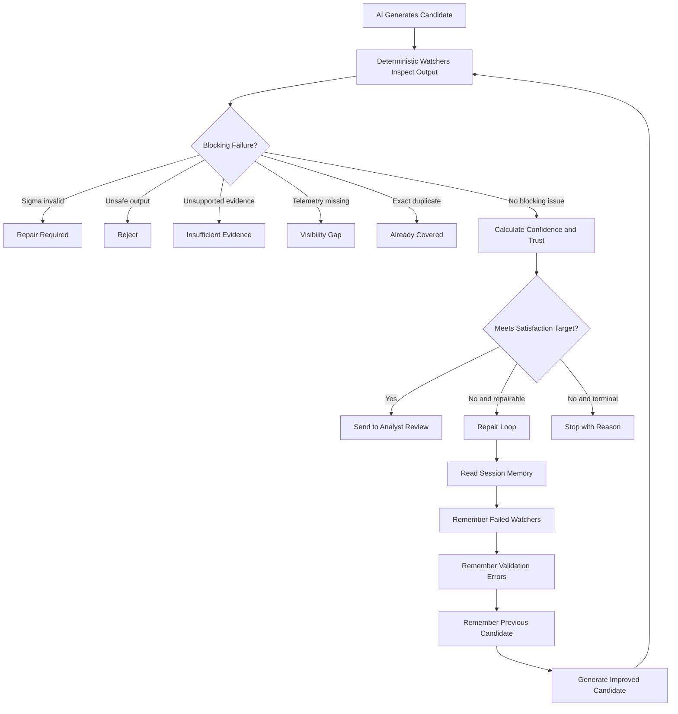
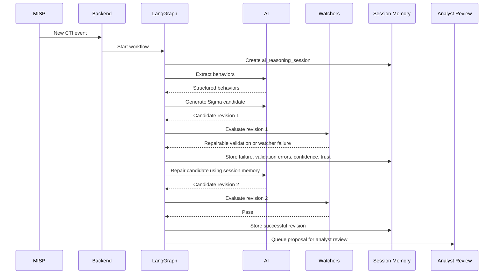
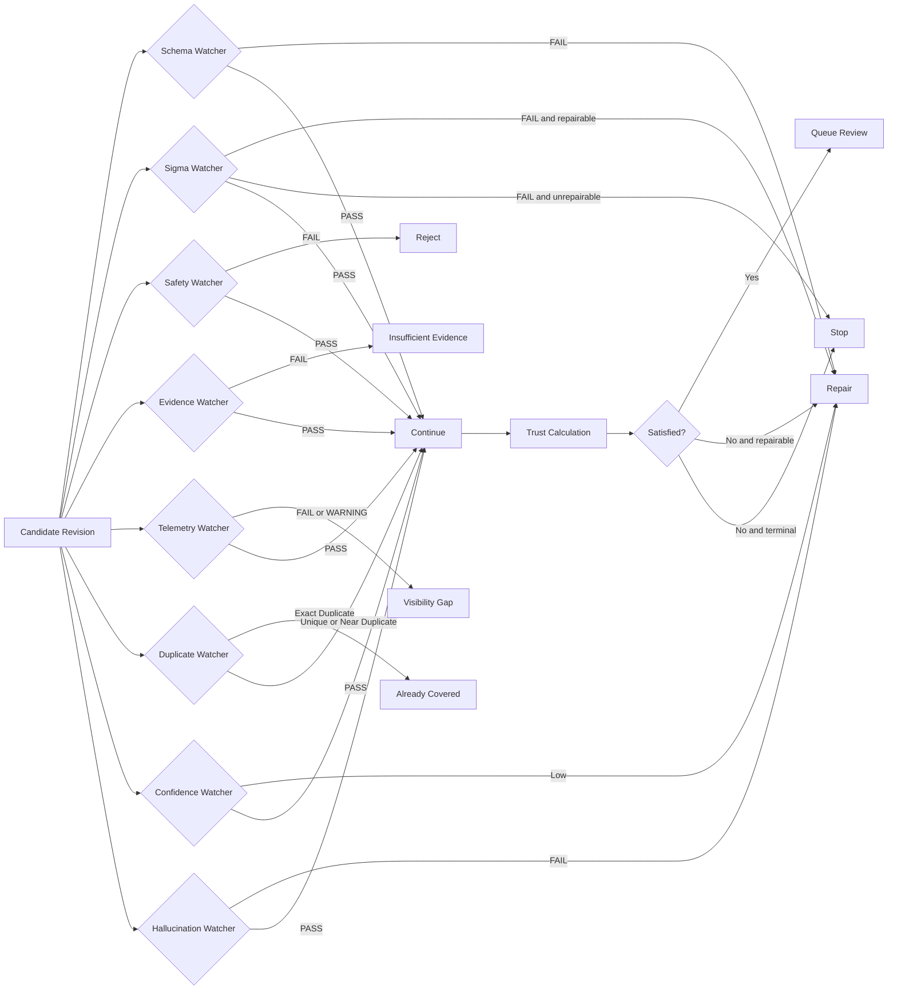
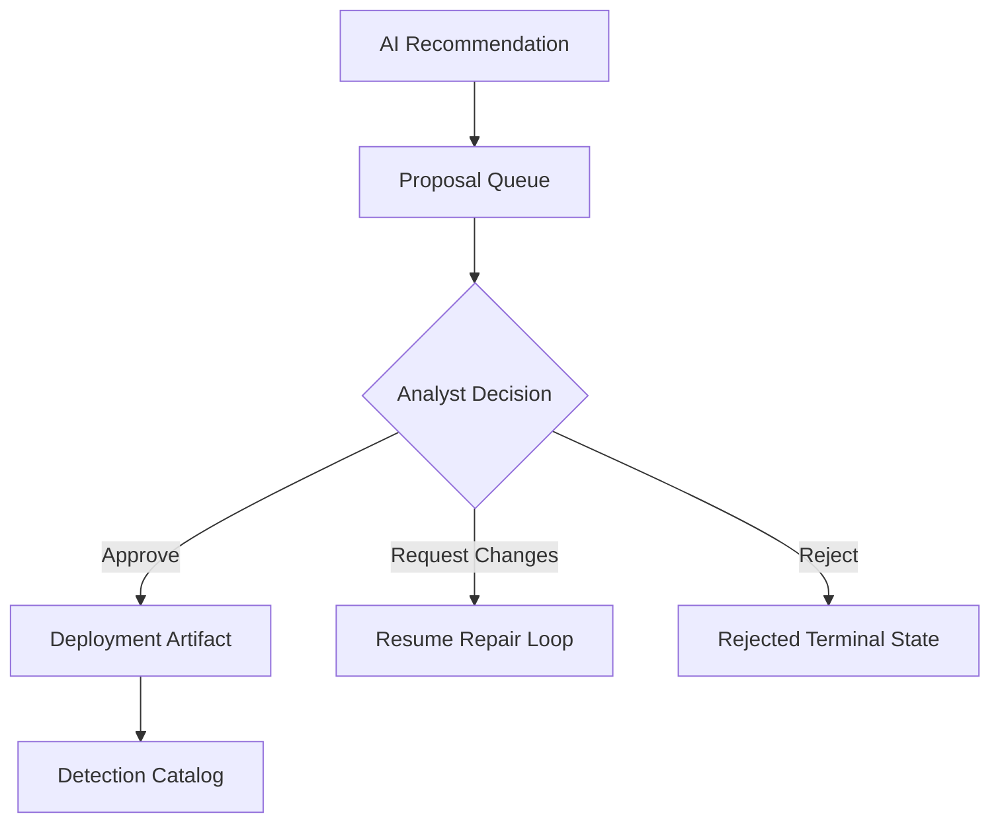

# AI Workflow Diagram

This document shows how the platform consumes MISP CTI, reasons over it, applies deterministic watchers, repairs failed candidates, and waits for analyst approval.

The AI is a bounded drafting and repair component. It does not deploy detections. Deterministic validation, trust scoring, policy routing, and analyst approval remain authoritative.

## End-To-End Workflow

```mermaid
flowchart LR
    A[MISP Event] --> B[Manual or Scheduled Ingestion]
    B --> C[Normalize CTI]
    C --> D[Create CTI Event]
    D --> E[Create Workflow]
    E --> F[Start LangGraph Run]
    F --> G[Start AI Reasoning Session]

    G --> H[Behavior Extraction]
    H --> H1[Behavior Watchers]
    H1 --> H2{Behavior Acceptable?}
    H2 -->|No - schema, evidence, or safety failure| X1[Terminal: Stop or Flag for Review]
    H2 -->|Yes or warning allowed| I[ATT&CK Mapping]

    I --> J[Deterministic ATT&CK Verification]
    J --> K[Coverage Analysis]
    K --> K1{Already Covered?}
    K1 -->|Yes| T1[Terminal: Already Covered]
    K1 -->|No| L[Visibility Analysis]
    L --> L1{Telemetry Available?}
    L1 -->|No| T2[Terminal: Visibility Gap]
    L1 -->|Yes| M[Policy Decision]
    M --> M1{Generate Detection?}
    M1 -->|No - insufficient evidence| T3[Terminal: Insufficient Evidence]
    M1 -->|Yes| N[AI Sigma Candidate Generation]

    subgraph SESSION[One ai_reasoning_session - bounded memory and revision history]
        direction LR
        N --> O[Create Reasoning Revision<br/>Revision N is an ai_reasoning_revision]
        O --> P[Watcher Evaluation]
        P --> Q[pySigma Validation]
        Q --> R[Calculate Confidence]
        R --> S[Calculate Trust]
        S --> U{REVISION SATISFIED?}

        U -->|YES| V[Create Proposal Revision]
        V --> W[Queue for Analyst Review]

        U -->|NO - repairable and revision budget remains| Y[Repair Candidate]
        Y --> Y1[Read Same-Session Memory]
        Y1 --> Y2[Previous Watcher Failures]
        Y2 --> Y3[Previous Validation Errors]
        Y3 --> Y4[Previous Candidate and Repair History]
        Y4 --> Y5[Generate Improved Candidate]
        Y5 --> Y6[Create Next Reasoning Revision<br/>Revision N+1 is an ai_reasoning_revision]
        Y6 ==>|BOUNDED SAME-SESSION REVISION LOOP<br/>watchers and validation run again| P

        U -->|NO - maximum revisions reached| T4[Terminal: Maximum Revisions Reached<br/>Needs Analyst Review]
        U -->|NO - no meaningful improvement| T5[Terminal: No Meaningful Improvement<br/>Needs Analyst Review]
        U -->|NO - blocking safety failure| T6[Terminal: Rejected]
    end

    subgraph REVISION_TRACE[Revision trace]
        direction LR
        RN[Revision N] --> EV[Evaluation]
        EV --> RP[Repair]
        RP --> RNP[Revision N+1]
    end

    P --> P1[Schema Watcher]
    P --> P2[Evidence Watcher]
    P --> P3[ATT&CK Watcher]
    P --> P4[Sigma Watcher]
    P --> P5[Confidence Watcher]
    P --> P6[Duplicate Watcher]
    P --> P7[Telemetry Watcher]
    P --> P8[Hallucination Watcher]
    P --> P9[Safety Watcher]

    P1 -.-> Q
    P2 -.-> Q
    P3 -.-> Q
    P4 -.-> Q
    P5 -.-> Q
    P6 -.-> Q
    P7 -.-> Q
    P8 -.-> Q
    P9 -.-> Q

    P6 -->|Exact duplicate| T1
    P7 -->|Telemetry gap| T2

    W --> Z{Analyst Decision}
    Z -->|Approve| AA[Deploy Detection Artifact]
    Z -->|Request Changes| Y1
    Z -->|Reject| T6
    AA --> AB[Detection Catalog]
    W --> NOTE[AI only recommends.<br/>AI never approves or deploys directly.]

    classDef loop fill:#fff5d6,stroke:#b7791f,stroke-width:3px;
    classDef decision fill:#e8f1ff,stroke:#315aa6,stroke-width:2px;
    classDef terminal fill:#ffe8e8,stroke:#a63232,stroke-width:2px;
    classDef review fill:#e8fff1,stroke:#20784a,stroke-width:2px;
    class Y,Y1,Y2,Y3,Y4,Y5,Y6,RN,EV,RP,RNP loop;
    class U,H2,K1,L1,M1,Z decision;
    class T1,T2,T3,T4,T5,T6,X1 terminal;
    class W,V,AA,AB review;
```

## How The AI Reasons

The AI does not reason without control. It produces structured outputs, then deterministic services inspect those outputs.

## Same-Session Repair Loop

The repair loop must stay inside the same `ai_reasoning_session`. A failed candidate creates a revision, the repair reads session memory, and the fixed candidate creates a later revision under the same session.

## Watcher Routing

Watchers produce `PASS`, `WARNING`, or `FAIL`. Their output feeds the satisfaction decision and can route the workflow to repair, review, rejection, or a terminal state.

## Runtime Concepts

| Concept | Meaning |
|---|---|
| `ai_reasoning_session` | One bounded reasoning session for a workflow run. |
| `ai_reasoning_revision` | One candidate attempt inside the session. |
| `parent_reasoning_revision_id` | Links a repaired revision to the failed prior revision. |
| `watcher_results` | Structured watcher outputs for a revision. |
| `validation_results` | pySigma, quality, duplicate, and satisfaction evidence. |
| `confidence_score` | Candidate confidence derived from AI confidence and deterministic factors. |
| `trust_score` | Deterministic trust score used for recommendations. |
| `route_selected` | Runtime route chosen by the satisfaction gate. |
| `session_summary` | Structured session memory used during repair. |

## What The AI Is Allowed To Do

The AI may:

- extract behavior from normalized CTI;
- draft Sigma candidates;
- propose ATT&CK mappings;
- repair a failed candidate;
- provide structured justification;
- recommend review outcomes.

The AI may not:

- directly approve detections;
- directly deploy detections;
- bypass pySigma validation;
- bypass watcher routing;
- bypass analyst approval;
- persist hidden chain-of-thought.

## Human Approval Boundary

The final deployment authority is the analyst, not the AI.
