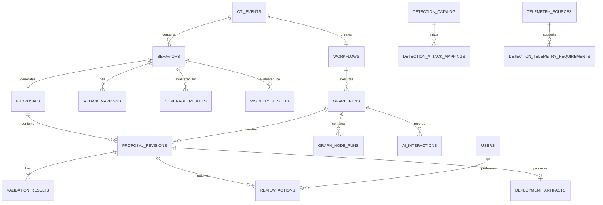
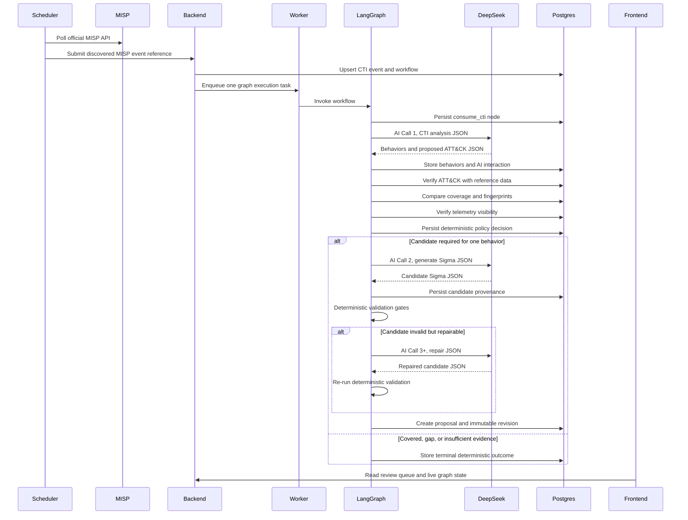
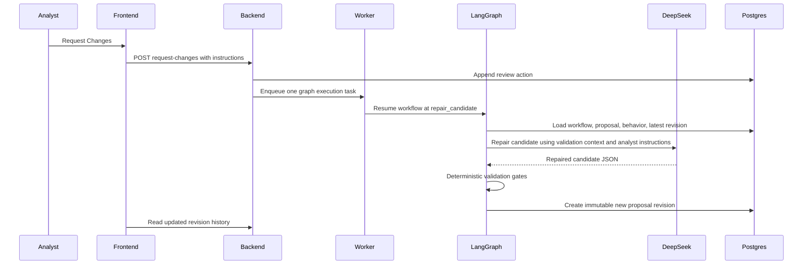
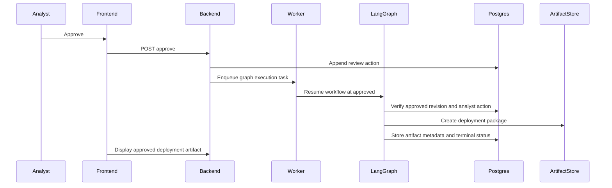

# AI-Driven CTI Detection Engineering Platform Architecture

## 1. Architecture Principles

This platform automates the detection engineering lifecycle while preserving deterministic platform authority and human approval control.

Core rules:

1. MISP API polling is the only CTI ingestion path.
2. LangGraph is the only workflow orchestration engine.
3. Celery only schedules, polls, and invokes graph executions in the background.
4. DeepSeek is a reasoning and generation engine, never the source of truth.
5. Deterministic backend services verify ATT&CK, telemetry, coverage, duplicate detection, Sigma validity, Sigma compilation, quality score, proposal lifecycle, and deployment.
6. One CTI event may produce multiple behaviors.
7. One proposal always represents exactly one behavior.
8. Request Changes never overwrites proposal data.
9. Every proposal revision is immutable.
10. Only validated proposals enter the review queue.
11. Only analysts approve, request changes, or reject.
12. Deployment artifacts are generated only after analyst approval.

## 2. Component Architecture

| Component     | Technology                                         | Responsibility                                                           |
| ------------- | -------------------------------------------------- | ------------------------------------------------------------------------ |
| Frontend      | Next.js, React, TypeScript, TailwindCSS, shadcn/ui | SOC analyst interface, live graph observability, queues, review workflow |
| Backend API   | Python, FastAPI, Pydantic v2                       | REST API, JWT auth, review actions, settings, deterministic services     |
| Worker        | Celery worker                                      | Invokes one LangGraph execution per background task                      |
| Scheduler     | Celery Beat or equivalent                          | Periodically starts MISP polling task                                    |
| Graph Engine  | LangGraph                                          | Sole authoritative workflow orchestration                                |
| Database      | PostgreSQL                                         | Source of truth for CTI, behaviors, workflow runs, revisions, audit data |
| Broker        | Redis                                              | Celery broker/result backend and transient execution coordination        |
| MISP          | Official MISP Docker deployment                    | CTI source, isolated from platform internals                             |
| Reverse Proxy | nginx                                              | Local production-style ingress for frontend and backend                  |
| AI Provider   | DeepSeek API                                       | Structured JSON reasoning, Sigma generation, Sigma repair                |

## 3. Deterministic Authority Boundaries

DeepSeek may propose:

| AI Capability                | Accepted As Source Of Truth |
| ---------------------------- | --------------------------- |
| CTI behavior extraction      | No                          |
| ATT&CK mapping proposal      | No                          |
| Detection coverage reasoning | No                          |
| Telemetry reasoning          | No                          |
| Sigma candidate generation   | No                          |
| Sigma repair                 | No                          |
| Structured justification     | No                          |

Deterministic services are authoritative for:

| Area                                 | Authoritative Service                         |
| ------------------------------------ | --------------------------------------------- |
| ATT&CK technique and tactic validity | ATT&CK reference service backed by PostgreSQL |
| Existing detection coverage          | Detection catalog and coverage service        |
| Behavior duplicate detection         | Fingerprint and similarity service            |
| Telemetry availability               | Telemetry inventory service                   |
| Sigma schema validity                | Sigma validation service                      |
| pySigma compilation                  | Compilation service                           |
| Quality score                        | Scoring policy service                        |
| Proposal lifecycle                   | Review service and database constraints       |
| Deployment decisions                 | Human review action and deployment service    |

The operating model is:

AI proposes. The platform verifies. The analyst decides.

## 4. Optimized AI Call Design

The graph minimizes API usage while preserving reasoning quality.

### AI Call 1: CTI Analysis

Used in `extract_behaviors`.

Responsibilities:

| Output                   | Description                                    |
| ------------------------ | ---------------------------------------------- |
| Behavior candidates      | One or more independently detectable behaviors |
| Evidence references      | References into normalized CTI evidence        |
| Proposed ATT&CK mappings | Technique and tactic candidates                |
| Structured justification | Rationale, uncertainty, confidence             |

### Deterministic Verification After AI Call 1

Performed by platform services:

| Step                    | Deterministic Action                                                         |
| ----------------------- | ---------------------------------------------------------------------------- |
| `verify_attack_mapping` | Verify ATT&CK IDs, tactics, revoked/deprecated status, mapping consistency   |
| `coverage_analysis`     | Compare behavior to detection catalog and fingerprints                       |
| `visibility_analysis`   | Compare required telemetry to inventory                                      |
| `policy_decision`       | Decide covered, visibility gap, insufficient evidence, or generate candidate |

### AI Call 2: Sigma Generation

Used only when `policy_decision` returns `generate_candidate`.

Responsibilities:

| Output                     | Description                               |
| -------------------------- | ----------------------------------------- |
| Sigma candidate            | Rule as structured JSON plus YAML         |
| Detection intent           | Structured mapping from evidence to logic |
| False positive notes       | Structured notes only                     |
| Confidence and uncertainty | Numeric and categorical metadata          |

### Deterministic Validation After AI Call 2

Performed by platform services:

| Gate                   | Deterministic Action                                       |
| ---------------------- | ---------------------------------------------------------- |
| Schema validation      | Validate candidate with Pydantic v2 models                 |
| Sigma validation       | Validate Sigma structure and required fields               |
| pySigma compilation    | Compile to configured target backend                       |
| Quality scoring        | Score specificity, evidence support, field usage, FP risk  |
| Duplicate detection    | Compare candidate fingerprint and logic similarity         |
| Telemetry verification | Confirm all referenced telemetry exists and is enabled     |
| ATT&CK verification    | Confirm candidate ATT&CK metadata matches verified mapping |

### AI Call 3+: Repair

Used only when validation fails and the failure is repairable.

Responsibilities:

| Output             | Description                                              |
| ------------------ | -------------------------------------------------------- |
| Repaired candidate | New Sigma candidate revision                             |
| Change summary     | Structured list of changes made                          |
| Addressed failures | Structured mapping from validation errors to corrections |

Repair attempts are capped by settings. Exhaustion fails the graph run and no proposal is queued.

## 5. Authoritative LangGraph Workflow

There is exactly one graph.

```text
consume_cti
  -> extract_behaviors
  -> verify_attack_mapping
  -> coverage_analysis
  -> visibility_analysis
  -> policy_decision
  -> generate_candidate
  -> validate_candidate
  -> repair_candidate
  -> queue_review
  -> approved
  -> deployment
```

Conditional routing happens only inside this graph.

Important routing behavior:

| From Node            | Condition                 | Next Node                            |
| -------------------- | ------------------------- | ------------------------------------ |
| `policy_decision`    | Already covered           | Terminal finished state, no proposal |
| `policy_decision`    | Visibility gap            | Terminal finished state, no proposal |
| `policy_decision`    | Insufficient evidence     | Terminal finished state, no proposal |
| `policy_decision`    | Candidate required        | `generate_candidate`                 |
| `validate_candidate` | Valid                     | `queue_review`                       |
| `validate_candidate` | Repairable invalid        | `repair_candidate`                   |
| `validate_candidate` | Unrepairable invalid      | Terminal failed state, no proposal   |
| `repair_candidate`   | Repaired                  | `validate_candidate`                 |
| `queue_review`       | Proposal queued           | Terminal waiting review state        |
| `approved`           | Analyst approved          | `deployment`                         |
| `approved`           | Analyst requested changes | `repair_candidate`                   |
| `approved`           | Analyst rejected          | Terminal rejected state              |
| `deployment`         | Artifact created          | Terminal approved/deployed state     |

The `approved` node is not AI approval. It is a graph resume point that consumes an already persisted analyst action and routes accordingly.

## 6. Graph Node Contracts

Every node has persisted inputs, outputs, current node, previous node, retry count, start time, end time, duration, terminal status, and failure reason.

| Node                    | Inputs                                                    | Outputs                                                        | Retry Policy                                      | Failure Policy                                                       |
| ----------------------- | --------------------------------------------------------- | -------------------------------------------------------------- | ------------------------------------------------- | -------------------------------------------------------------------- |
| `consume_cti`           | `cti_event_id`, workflow context                          | Normalized CTI snapshot                                        | Retry transient DB errors                         | Mark workflow failed if CTI missing or invalid                       |
| `extract_behaviors`     | Normalized CTI, evidence                                  | Behavior candidates and proposed ATT&CK mappings               | Retry DeepSeek/network/schema errors within limit | Mark failed if no valid structured response                          |
| `verify_attack_mapping` | Proposed mappings                                         | Verified mapping records, rejected mappings                    | Retry DB/reference errors                         | Insufficient evidence if no valid mapping remains                    |
| `coverage_analysis`     | Behavior, verified mappings, detection catalog            | Coverage result and matches                                    | Retry DB errors                                   | Mark failed on service error                                         |
| `visibility_analysis`   | Behavior, mappings, telemetry inventory                   | Visibility result                                              | Retry DB errors                                   | Mark visibility gap when required telemetry missing                  |
| `policy_decision`       | Behavior, coverage, visibility, evidence                  | Deterministic decision                                         | No AI retry                                       | Terminal decision on policy outcome                                  |
| `generate_candidate`    | One behavior, verified ATT&CK, telemetry, evidence        | Sigma candidate                                                | Retry DeepSeek/network/schema errors              | Mark failed if candidate cannot be generated                         |
| `validate_candidate`    | Sigma candidate, behavior, mappings, telemetry            | Validation result, compilation result, score, duplicate result | Retry transient compiler/service errors           | Route repairable failures to repair, unrepairable failures to failed |
| `repair_candidate`      | Candidate, validation errors, analyst instructions if any | Repaired candidate                                             | Retry DeepSeek/network/schema errors              | Mark failed after repair limit                                       |
| `queue_review`          | Valid candidate and all gate results                      | Proposal revision queued                                       | Retry DB errors                                   | Mark failed if immutable revision cannot be stored                   |
| `approved`              | Proposal, analyst action                                  | Review route decision                                          | Retry DB errors                                   | Remain waiting review if no action exists                            |
| `deployment`            | Approved proposal revision                                | Deployment artifact metadata                                   | Retry artifact errors                             | Mark deployment failed without changing immutable revision           |

## 7. Workflow, Behavior, Proposal, and Revision Model

Definitions:

| Entity    | Meaning                                                            |
| --------- | ------------------------------------------------------------------ |
| CTI event | One MISP event after normalization                                 |
| Workflow  | Logical lifecycle for one CTI event                                |
| Graph run | One execution attempt or resume of the LangGraph workflow          |
| Behavior  | One independently detectable adversary behavior extracted from CTI |
| Proposal  | One reviewable detection proposal for exactly one behavior         |
| Revision  | Immutable version of a proposal candidate                          |

Rules:

1. One CTI event creates one workflow.
2. One workflow may contain many graph runs.
3. One CTI event may produce many behaviors.
4. One behavior may create at most one active proposal.
5. One proposal references exactly one behavior.
6. One proposal has many immutable revisions.
7. Request Changes creates a new graph run and a new proposal revision.
8. Request Changes preserves `workflow_id` and `proposal_id`.
9. Graph runs are separate from proposal revisions.
10. A graph run may create a proposal revision, but the revision remains immutable after creation.

## 8. Database Schema

### ER Diagram



### Core Workflow Tables

| Table             | Key Fields                                                                                                                                                                                                                             |
| ----------------- | -------------------------------------------------------------------------------------------------------------------------------------------------------------------------------------------------------------------------------------- |
| `cti_events`      | `id`, `misp_event_id`, `source`, `title`, `raw_event`, `normalized_event`, `status`, `received_at`, timestamps                                                                                                                         |
| `workflows`       | `id`, `cti_event_id`, `status`, `created_at`, `updated_at`, `completed_at`, `terminal_reason`                                                                                                                                          |
| `graph_runs`      | `id`, `workflow_id`, `resume_from_node`, `status`, `current_node`, `previous_node`, `started_at`, `finished_at`, `duration_ms`, `retry_count`, `total_tokens`, `estimated_cost`, `failure_reason`                                      |
| `graph_node_runs` | `id`, `graph_run_id`, `node_name`, `previous_node`, `status`, `retry_count`, `input_snapshot`, `output_snapshot`, `started_at`, `finished_at`, `duration_ms`, `failure_reason`                                                         |
| `ai_interactions` | `id`, `graph_run_id`, `graph_node_run_id`, `provider`, `model`, `prompt_version`, `schema_name`, `input_hash`, `request_json`, `response_json`, `structured_justification`, `confidence`, token fields, `estimated_cost`, `created_at` |

### CTI and Detection Tables

| Table                              | Key Fields                                                                                                                                                        |
| ---------------------------------- | ----------------------------------------------------------------------------------------------------------------------------------------------------------------- |
| `behaviors`                        | `id`, `cti_event_id`, `workflow_id`, `source_graph_run_id`, `summary`, `behavior_type`, `evidence_refs`, `observables`, `fingerprint`, `confidence`, timestamps   |
| `attack_mappings`                  | `id`, `behavior_id`, `technique_id`, `technique_name`, `tactic_id`, `tactic_name`, `verified`, `verification_status`, `evidence_refs`, `confidence`               |
| `attack_techniques`                | `technique_id`, `name`, `description`, `revoked`, `deprecated`, `tactics`, `platforms`, `data_sources`, `version`                                                 |
| `detection_catalog`                | `id`, `name`, `detection_type`, `source`, `content`, `normalized_logic`, `behavior_fingerprint`, `status`, timestamps                                             |
| `detection_attack_mappings`        | `id`, `detection_id`, `technique_id`, `tactic_id`                                                                                                                 |
| `detection_telemetry_requirements` | `id`, `detection_id`, `telemetry_source_id`, `required_fields`                                                                                                    |
| `telemetry_sources`                | `id`, `name`, `category`, `platform`, `enabled`, `retention_days`, `fields`, `owner`, `updated_at`                                                                |
| `coverage_results`                 | `id`, `workflow_id`, `graph_run_id`, `behavior_id`, `coverage_status`, `matching_detection_ids`, `similarity_score`, `deterministic_rationale`                    |
| `visibility_results`               | `id`, `workflow_id`, `graph_run_id`, `behavior_id`, `visibility_status`, `required_sources`, `available_source_ids`, `missing_sources`, `deterministic_rationale` |

### Proposal and Review Tables

| Table                  | Key Fields                                                                                                                                                                                                               |
| ---------------------- | ------------------------------------------------------------------------------------------------------------------------------------------------------------------------------------------------------------------------ |
| `proposals`            | `id`, `behavior_id`, `workflow_id`, `status`, `current_revision_number`, `confidence`, `quality_score`, timestamps                                                                                                       |
| `proposal_revisions`   | `id`, `proposal_id`, `behavior_id`, `workflow_id`, `graph_run_id`, `revision_number`, `sigma_yaml`, `sigma_json`, `structured_justification`, `confidence`, `token_usage`, `estimated_cost`, `created_at`                |
| `validation_results`   | `id`, `proposal_revision_id`, `schema_valid`, `sigma_valid`, `compilation_success`, `quality_score`, `duplicate_status`, `telemetry_verified`, `attack_verified`, `errors`, `warnings`, `compiled_outputs`, `created_at` |
| `review_actions`       | `id`, `proposal_id`, `proposal_revision_id`, `analyst_id`, `action`, `comment`, `created_at`                                                                                                                             |
| `deployment_artifacts` | `id`, `proposal_id`, `proposal_revision_id`, `artifact_type`, `file_path`, `checksum`, `metadata`, `created_at`                                                                                                          |

### Auth, Settings, and Health Tables

| Table                  | Key Fields                                                                   |
| ---------------------- | ---------------------------------------------------------------------------- |
| `users`                | `id`, `email`, `password_hash`, `display_name`, `role`, `active`, timestamps |
| `settings`             | `key`, `value`, `updated_at`                                                 |
| `misp_poll_state`      | `id`, `last_event_timestamp`, `last_event_id`, `updated_at`                  |
| `system_health_checks` | `id`, `component`, `status`, `details`, `checked_at`                         |

### Database Constraints

| Constraint                                    | Purpose                                                                   |
| --------------------------------------------- | ------------------------------------------------------------------------- |
| Unique `cti_events.misp_event_id`             | Prevent duplicate ingestion                                               |
| Unique active proposal per `behavior_id`      | Enforce one behavior to one active proposal                               |
| Unique `proposal_id`, `revision_number`       | Preserve immutable revision ordering                                      |
| Foreign key `proposals.behavior_id`           | Enforce one proposal equals one behavior                                  |
| Foreign key `proposal_revisions.graph_run_id` | Separate graph execution from revision storage while retaining provenance |
| Append-only `proposal_revisions`              | No updates after insert except database-managed metadata if required      |
| Append-only `review_actions`                  | Audit analyst decisions                                                   |

## 9. Docker Topology

```text
                            External
                         DeepSeek API
                              |
                              v
  -----------------------------------------------------------------
  Docker network: platform_internal

                nginx
                  |
        ---------------------
        |                   |
     frontend            backend
                            |
          -------------------------------------
          |              |           |        |
       postgres        redis      worker   scheduler
                                      |        |
                                      |        v
                                      |    MISP API client
                                      |
                                   LangGraph

  -----------------------------------------------------------------
  Docker network: misp_internal

              Official MISP Docker deployment
              MISP app, MISP workers, MISP database/cache services
```

MISP is not a fake service and is not simplified into a mock. The platform communicates with MISP only through the MISP API using configured credentials.

Required containers:

| Container   | Notes                                      |
| ----------- | ------------------------------------------ |
| `frontend`  | Next.js production server                  |
| `backend`   | FastAPI app                                |
| `worker`    | Celery worker invoking LangGraph           |
| `scheduler` | Celery scheduler and MISP poll trigger     |
| `postgres`  | Platform PostgreSQL                        |
| `redis`     | Platform Redis                             |
| `misp`      | Official MISP Docker deployment entrypoint |
| `nginx`     | Reverse proxy                              |

MISP may require additional official supporting containers depending on the official Docker deployment. Those remain isolated under the MISP deployment network and are not replaced by platform code.

## 10. Sequence Diagrams

### New MISP Event To Review Queue



### Request Changes



### Approval To Deployment



## 11. API Architecture

Base path: `/api/v1`

### Authentication

| Method | Path            | Role          | Purpose                      |
| ------ | --------------- | ------------- | ---------------------------- |
| `POST` | `/auth/login`   | Public        | Exchange credentials for JWT |
| `POST` | `/auth/refresh` | Authenticated | Refresh JWT                  |
| `GET`  | `/auth/me`      | Authenticated | Current user and role        |

JWT roles:

| Role    | Permissions                                                  |
| ------- | ------------------------------------------------------------ |
| Admin   | Settings, telemetry, detection catalog, analyst actions      |
| Analyst | Queues, proposal review actions, read-only system visibility |

### Dashboard and Observability

| Method | Path                        | Purpose                                                                                          |
| ------ | --------------------------- | ------------------------------------------------------------------------------------------------ |
| `GET`  | `/dashboard/summary`        | Pending CTI, running graphs, queued reviews, coverage %, visibility %, confidence, cost, runtime |
| `GET`  | `/graph-runs`               | List graph executions                                                                            |
| `GET`  | `/graph-runs/{id}`          | Graph run detail                                                                                 |
| `GET`  | `/graph-runs/{id}/timeline` | Node timeline with current node, previous node, duration, retries, tokens, cost                  |
| `GET`  | `/graph-runs/{id}/events`   | Server-sent live graph events                                                                    |

### CTI

| Method | Path               | Purpose                                                   |
| ------ | ------------------ | --------------------------------------------------------- |
| `GET`  | `/cti-events`      | List MISP-ingested CTI events                             |
| `GET`  | `/cti-events/{id}` | CTI details, normalized event, behaviors, workflow status |

There is no manual CTI upload endpoint.

### Review

| Method | Path                                  | Purpose                                                              |
| ------ | ------------------------------------- | -------------------------------------------------------------------- |
| `GET`  | `/proposals`                          | List validated proposals                                             |
| `GET`  | `/proposals/{id}`                     | Proposal detail for one behavior                                     |
| `GET`  | `/proposals/{id}/revisions`           | Immutable revision history                                           |
| `GET`  | `/proposal-revisions/{id}/validation` | Validation and compilation results                                   |
| `POST` | `/proposals/{id}/approve`             | Append approval action and resume graph at `approved`                |
| `POST` | `/proposals/{id}/request-changes`     | Append request-changes action and resume graph at `repair_candidate` |
| `POST` | `/proposals/{id}/reject`              | Append rejection action and mark terminal rejected through graph     |

### Deterministic Platform Data

| Method  | Path                      | Purpose                             |
| ------- | ------------------------- | ----------------------------------- |
| `GET`   | `/detections`             | Detection catalog                   |
| `POST`  | `/detections/import`      | Admin import of existing detections |
| `GET`   | `/attack/coverage`        | ATT&CK coverage matrix              |
| `GET`   | `/attack/techniques/{id}` | ATT&CK reference detail             |
| `GET`   | `/telemetry-sources`      | Telemetry inventory                 |
| `POST`  | `/telemetry-sources`      | Admin create telemetry source       |
| `PATCH` | `/telemetry-sources/{id}` | Admin update telemetry source       |

### Operations

| Method  | Path               | Purpose                                      |
| ------- | ------------------ | -------------------------------------------- |
| `GET`   | `/automation-runs` | Alias for graph run history optimized for UI |
| `GET`   | `/system-health`   | Component health                             |
| `GET`   | `/settings`        | Runtime settings                             |
| `PATCH` | `/settings`        | Admin update settings                        |

## 12. Frontend Wireframes

### Global Shell

```text
Top bar: product name, environment, health state, signed-in user
Sidebar: Dashboard, Live AI Graph, Threat Queue, Review Queue, Proposal Details,
Telemetry Inventory, ATT&CK Coverage, Detection Catalog, Automation Runs,
System Health, Settings
Main panel: dense SOC workspace with dark mode
```

### Dashboard

```text
Metrics:
Pending CTI, Running Graphs, Queued Reviews, Coverage %, Visibility %,
Average Confidence, Average Cost, Average Runtime

Panels:
Recent deterministic decisions
Running graph executions
Review-ready proposals
System health
```

### Live AI Graph

```text
Graph:
consume_cti -> extract_behaviors -> verify_attack_mapping -> coverage_analysis
-> visibility_analysis -> policy_decision -> generate_candidate
-> validate_candidate -> repair_candidate -> queue_review -> approved -> deployment

Side panel:
workflow id
graph run id
current node
previous node
node status
retry count
elapsed time
token usage
estimated cost
structured justification
failure reason
```

### Threat Queue

```text
Table:
MISP event id, title, received time, workflow status, behavior count,
terminal decision counts, current graph run

Detail drawer:
Raw CTI, normalized CTI, extracted behaviors, verified ATT&CK mappings,
coverage results, visibility results
```

### Review Queue

```text
Table:
proposal id, behavior summary, ATT&CK technique, quality score,
confidence, revision number, cost, status

Detail:
CTI evidence, behavior summary, verified ATT&CK, telemetry requirements,
coverage comparison, Sigma, compilation result, quality score,
duplicate result, validation result, structured justification,
revision history

Actions:
Approve, Request Changes, Reject
```

### Proposal Details

```text
Header:
proposal id, behavior id, workflow id, current revision, status

Tabs:
Evidence, Behavior, ATT&CK, Telemetry, Coverage, Sigma, Validation,
Revisions, Graph Runs
```

### Telemetry Inventory

```text
Table:
source name, category, platform, enabled, retention, fields, owner

Impact panel:
techniques and proposals affected by missing or disabled telemetry
```

### ATT&CK Coverage

```text
Matrix:
tactics as columns, techniques as rows or grouped cells

Cell states:
covered, partial, not covered, visibility gap

Detail:
detections, telemetry, recent CTI, proposal history
```

### Detection Catalog

```text
Table:
name, detection type, source, status, ATT&CK mappings,
telemetry requirements, behavior fingerprint

Detail:
content, normalized logic, related behaviors, duplicate relationships
```

### Automation Runs

```text
Table:
workflow id, graph run id, CTI event, status, current node,
duration, retries, tokens, estimated cost, failure reason

Timeline:
node order, transitions, input and output snapshots, validation results
```

### System Health

```text
Components:
backend, worker, scheduler, postgres, redis, MISP API, DeepSeek API,
pySigma compiler, nginx
```

## 13. Documentation Package

| Document                   | Purpose                                                  |
| -------------------------- | -------------------------------------------------------- |
| `docs/ARCHITECTURE.md`     | Final architecture package                               |
| `docs/DEPLOYMENT_GUIDE.md` | Docker Compose deployment and environment setup          |
| `docs/DEVELOPER_GUIDE.md`  | Local development, migrations, tests, graph development  |
| `docs/SOC_USER_GUIDE.md`   | Analyst workflow and review decisions                    |
| `docs/API.md`              | API endpoint reference and schemas                       |
| `docs/CODING_RULES.md`     | Engineering standards, test policy, no-placeholder rules |

## 14. Implementation Roadmap

### Phase 1: Final Specification Baseline

1. Finalize architecture package.
2. Freeze graph node contracts.
3. Freeze normalized database schema.
4. Freeze API resource model.
5. Freeze Docker topology and environment contract.

### Phase 2: Repository and Infrastructure Foundation

1. Create repository layout.
2. Add Docker Compose services.
3. Add backend, frontend, worker, scheduler, postgres, redis, nginx foundations.
4. Integrate official MISP Docker deployment.
5. Add environment validation.

### Phase 3: Backend Source of Truth

1. Add FastAPI with JWT authentication and Admin/Analyst roles.
2. Add SQLAlchemy models and Alembic migrations.
3. Add repositories and service boundaries.
4. Add ATT&CK reference tables and deterministic verification service.
5. Add telemetry inventory and detection catalog services.

### Phase 4: MISP Ingestion

1. Implement scheduler-owned MISP polling.
2. Communicate with MISP only through its API.
3. Normalize events into strict Pydantic models.
4. Create CTI event and workflow records.
5. Enqueue one Celery task that invokes one LangGraph execution.

### Phase 5: LangGraph Workflow

1. Implement the single authoritative graph.
2. Add graph state persistence and node run observability.
3. Add optimized DeepSeek call 1 for behavior extraction and ATT&CK proposal.
4. Add deterministic ATT&CK, coverage, visibility, and policy decision nodes.
5. Add one behavior to one proposal routing.

### Phase 6: Candidate Generation and Validation

1. Add DeepSeek call 2 only for required candidates.
2. Add Sigma schema validation.
3. Add Sigma validation and pySigma compilation.
4. Add deterministic quality scoring.
5. Add duplicate detection and telemetry verification.
6. Add repair loop with bounded DeepSeek calls.

### Phase 7: Review and Deployment Lifecycle

1. Add validated proposal queue.
2. Add immutable proposal revisions.
3. Add approve, request changes, and reject APIs.
4. Resume graph on request changes and approval.
5. Generate deployment artifact only after approval.

### Phase 8: Frontend SOC Application

1. Build dark-mode SOC shell.
2. Build dashboard and live graph observability.
3. Build threat queue and automation runs.
4. Build review queue and proposal details.
5. Build telemetry inventory, ATT&CK coverage, detection catalog, health, and settings.
6. Ensure every page consumes real backend APIs.

### Phase 9: Testing and Reproducible Demonstration

1. Unit tests for deterministic services.
2. Integration tests for MISP ingestion, graph execution, validation gates, and request changes.
3. API tests for every endpoint.
4. Frontend component and workflow tests.
5. End-to-end Docker Compose test from MISP event to review action and deployment artifact.

## 15. Consistency Review

Resolved architectural inconsistencies:

| Issue                                      | Resolution                                                                                            |
| ------------------------------------------ | ----------------------------------------------------------------------------------------------------- |
| AI treated as authoritative for validation | Deterministic services are now source of truth                                                        |
| Excessive AI calls                         | Consolidated CTI analysis into one call, generation into one conditional call, repair only on failure |
| Proposal could contain multiple behaviors  | Enforced one proposal per behavior                                                                    |
| Request Changes could overwrite data       | Enforced new graph run and immutable new revision                                                     |
| Chain-of-thought storage risk              | Store only structured justification, evidence references, rationales, confidence, uncertainty         |
| Celery could become workflow engine        | Celery only invokes one graph execution task                                                          |
| MISP could be simplified                   | Official Docker MISP and API-only communication required                                              |
| Auth was underspecified                    | JWT with Admin and Analyst roles only                                                                 |
| Graph observability incomplete             | Workflow, graph run, node run, retry, timing, cost, token, and failure fields persisted               |
| Graph executions mixed with revisions      | `graph_runs` and `proposal_revisions` are separate with provenance links                              |

This architecture is now ready for implementation review. Coding should begin only after this package is accepted.
