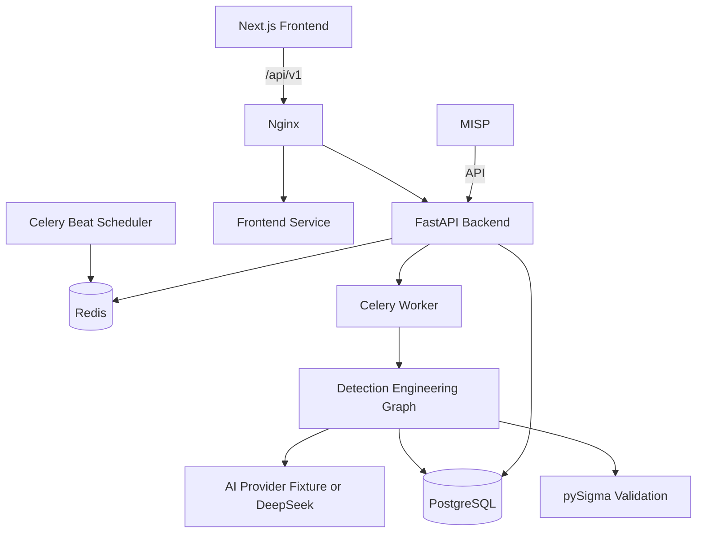
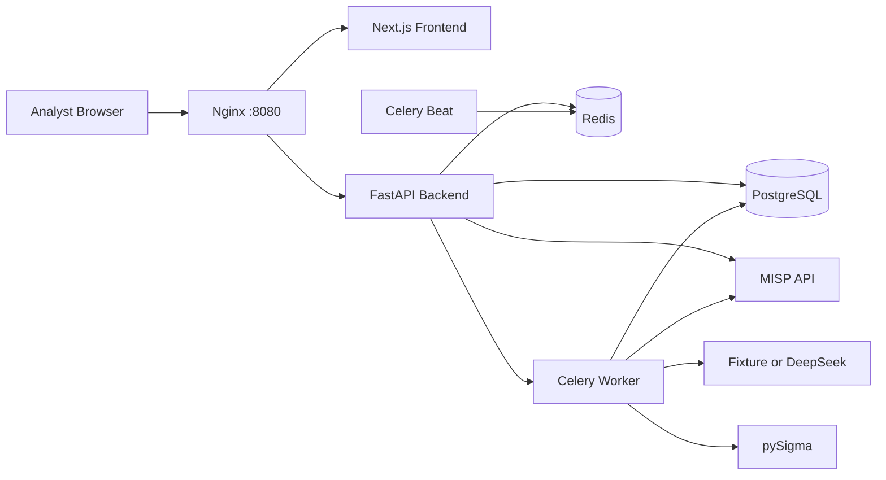
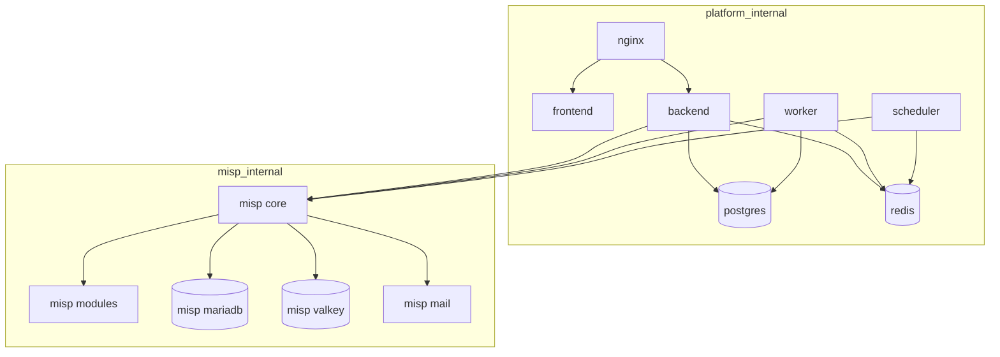
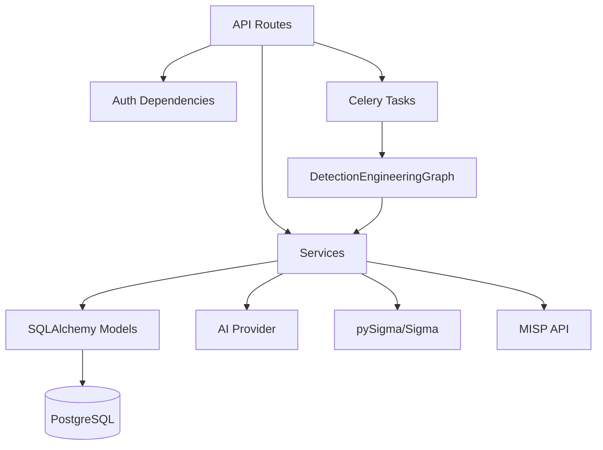
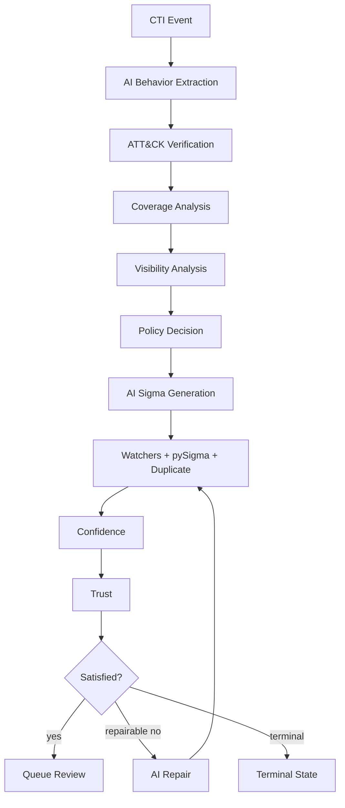
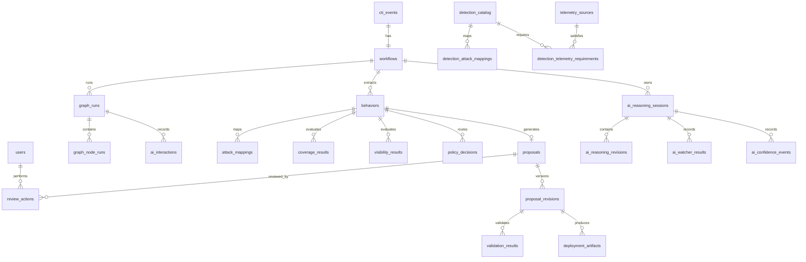
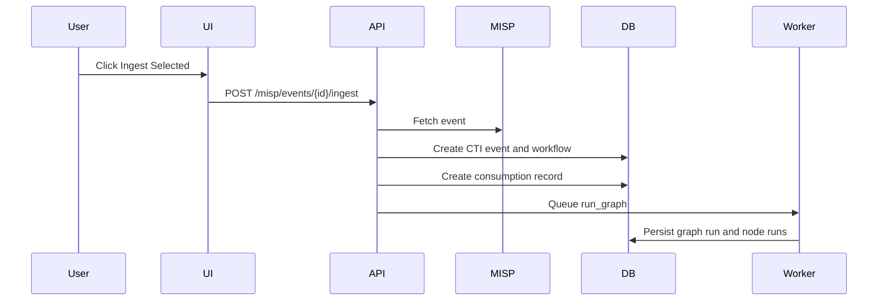
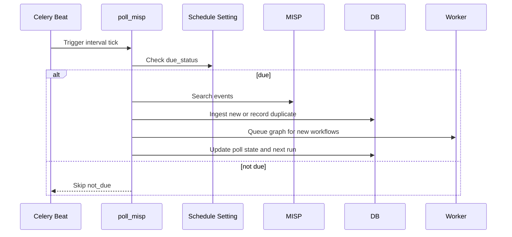
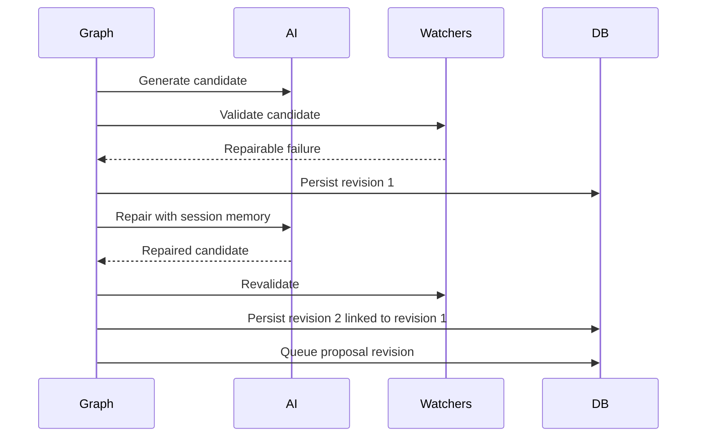
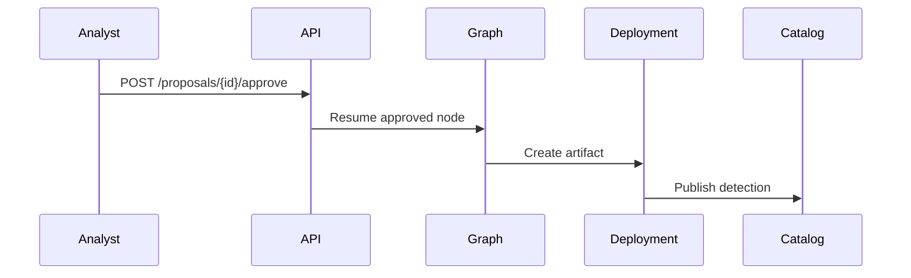

# Complete Technical Engineering Report

Repository analyzed: `cti internship`

Date of analysis: 2026-07-31

This document is a repository-derived technical reference for the AI-assisted CTI Detection Engineering Platform. It is intended to support a later university internship report. It is not a final academic report and does not invent functionality beyond the current repository.

Status labels used throughout:

- Implemented: source code exists and is integrated.
- Partially implemented: source exists but behavior is incomplete, limited, or not fully verified.
- Planned: documented or implied but not implemented.
- Runtime verified: evidence was previously produced from running services or artifacts in the project workflow.
- Tested: covered by tests in `scripts/backend`.
- Documented: described in `README.md` or `docs/`.

Important current verification note: after the last frontend build, Docker Desktop was not reachable from the shell (`docker version` failed with a missing `dockerDesktopLinuxEngine` pipe). Therefore, backend container rebuild/runtime verification for the newest scheduling UI/API changes was not possible during this analysis. Frontend `npm.cmd run build` passed locally.

---

## Section 1 - Project Overview

### Project Title

AI-Assisted CTI Detection Engineering Platform.

### Purpose

The platform converts Cyber Threat Intelligence from MISP into reviewed Sigma detections. It combines deterministic security engineering controls with bounded AI assistance. The AI drafts and repairs detection candidates, but deterministic gates and human analyst approval control deployment.

### Objectives

The repository implements a platform with these objectives:

- Ingest CTI from a real MISP API path.
- Normalize MISP events and attributes into internal CTI records.
- Extract attacker behaviors from CTI using an AI provider abstraction.
- Verify proposed ATT&CK mappings against a local technique catalog.
- Analyze existing detection coverage.
- Analyze telemetry visibility.
- Decide whether to generate a detection, stop as covered, stop as visibility gap, or stop due to insufficient evidence.
- Generate Sigma candidates.
- Validate Sigma with schema checks and pySigma compilation.
- Detect duplicates and near duplicates.
- Apply watchers to constrain AI behavior.
- Calculate confidence and deterministic trust.
- Repair failed candidates inside a bounded same-session revision loop.
- Queue candidates for human analyst review.
- Require analyst approval before deployment.
- Generate deployment artifacts and publish approved detections into a catalog.
- Expose SOC-oriented frontend pages for queues, AI workflow, graph runs, reviews, detections, coverage, telemetry, health, and settings.

### Problems Addressed

The system addresses several operational problems:

- CTI often arrives as unstructured or semi-structured event data.
- Analysts must manually decide whether CTI describes behavior that needs new detection logic.
- Manual ATT&CK mapping can be inconsistent.
- Detection engineering requires checking existing coverage and telemetry feasibility.
- AI-generated detection logic can be invalid, unsafe, hallucinated, unsupported, or duplicate.
- Review and deployment require audit trails, revision history, and approval boundaries.

### Scope

In scope:

- Local Docker-based demonstration deployment.
- MISP integration through official MISP Docker images under a Compose profile.
- FastAPI backend.
- PostgreSQL persistence.
- Redis/Celery worker and scheduler.
- Next.js frontend.
- LangGraph-style workflow orchestration.
- AI fixture mode and DeepSeek provider abstraction.
- Sigma and pySigma validation.
- Analyst review and catalog publication.

Out of scope or not complete:

- Production authentication hardening beyond local JWT roles.
- Full SIEM deployment integration.
- Full live DeepSeek runtime verification with real credentials.
- Full monitoring/observability stack.
- Enterprise-grade RBAC, audit exports, and alerting.
- Broad real-world ATT&CK corpus coverage.

### Users

- SOC analysts.
- Detection engineers.
- Security architects.
- Internship evaluators or supervisors.
- Local demo operators.

### Constraints

- Local Docker Compose is the main runtime model.
- MISP is optional through the `misp` profile, so it must be explicitly started.
- AI defaults to fixture mode for repeatable demos.
- Analyst approval is mandatory before deployment.
- Docker availability is required for full runtime validation.

### Technologies

Backend:

- Python 3.11
- FastAPI
- SQLAlchemy 2
- Alembic
- PostgreSQL
- Redis
- Celery
- LangGraph
- PyMISP
- Pydantic
- python-jose/passlib/bcrypt
- pySigma and Splunk backend

Frontend:

- Next.js 14
- React 18
- TypeScript
- Tailwind CSS
- lucide-react

Infrastructure:

- Docker Compose
- Nginx
- official MISP Docker images
- MariaDB for MISP
- Valkey for MISP cache

### High-Level Architecture



---

## Section 2 - Business Problem

### Why The Platform Exists

Security teams receive CTI faster than detection engineers can manually triage, interpret, map, implement, validate, and deploy detections. MISP provides event data and indicators, but it does not automatically transform CTI into trustworthy detection content. Detection engineering requires reasoning about attacker behavior, ATT&CK techniques, telemetry availability, existing coverage, duplicate logic, validation, and review.

### Problems With Traditional CTI Handling

Traditional CTI handling often has these issues:

- Events are reviewed manually.
- Indicators may be consumed without behavioral interpretation.
- CTI-to-detection handoff is informal.
- Duplicates and near-duplicates accumulate.
- There is limited auditability of why a detection was or was not created.
- MISP event status does not necessarily reflect detection engineering outcome.

### Problems With Manual Detection Engineering

Manual detection engineering is slow because engineers must:

- extract behavior from narrative CTI;
- choose ATT&CK techniques;
- check if detections already exist;
- confirm telemetry availability;
- write Sigma;
- compile to SIEM syntax;
- review false positives;
- handle repeated revisions.

The repository attempts to automate repetitive drafting while preserving deterministic and human controls.

### How The Platform Solves Them

The platform:

- consumes MISP events into normalized CTI records;
- uses AI to extract behavior and draft Sigma;
- applies deterministic ATT&CK, coverage, visibility, policy, duplicate, Sigma, confidence, and trust checks;
- repairs candidates only when repairable;
- persists every graph node, watcher result, confidence event, and revision;
- requires analyst approval before catalog publication.

---

## Section 3 - Requirements

### Functional Requirements

Implemented or partially implemented functional requirements:

- User authentication and JWT session handling.
- Admin and analyst roles.
- MISP event listing, detail fetch, single ingest, bulk ingest, and schedule configuration.
- CTI event listing, detail retrieval, manual workflow execution, and reprocessing.
- Graph run creation and timeline inspection.
- AI dashboard for sessions, watchers, confidence, trust, consumption.
- AI workflow visualization endpoint and frontend page.
- Proposal listing, workspace, revision history, validation detail.
- Approve, request changes, and reject actions.
- Deployment artifact lookup and download.
- Detection catalog listing/detail/import.
- Telemetry source listing/create/update.
- ATT&CK coverage matrix.
- System health checks.
- Settings listing/update.

### Non-Functional Requirements

Partially implemented:

- Auditability through persisted graph node runs, AI interactions, revisions, watcher results, and consumption records.
- Local reproducibility through Docker Compose and fixture AI mode.
- Service isolation through Docker networks.
- Idempotency constraints on several repeated operations.
- Configurability through environment variables and settings table.

Not fully implemented:

- Production monitoring and alerting.
- High availability.
- Load testing.
- Horizontal scalability documentation.
- Full OpenAPI examples for every endpoint.

### Security Requirements

Implemented:

- JWT access and refresh tokens.
- Password hashing through passlib/bcrypt.
- Role checks through FastAPI dependencies.
- Secrets via environment variables.
- MISP TLS verification configurable.
- AI safety watcher.
- AI chain-of-thought is not intentionally persisted.

Partial:

- Local default credentials exist and must be changed.
- No advanced account lockout, MFA, or enterprise identity provider integration.
- Secrets are documented in `.env.example`, but local `.env` may contain real local secrets.

### Performance Requirements

Implemented/partial:

- Celery worker offloads graph runs from HTTP request path.
- Redis is used as Celery broker/result backend.
- PostgreSQL stores durable state.
- Pagination exists on many list endpoints.

Not implemented:

- Load tests.
- Query optimization audit.
- Backpressure strategy beyond Celery queue.
- Worker autoscaling.

### AI Requirements

Implemented:

- AI provider abstraction.
- Deterministic fixture provider.
- DeepSeek live provider abstraction.
- Strict Pydantic schemas.
- JSON-only prompt contracts.
- AI interaction persistence.
- Confidence and trust separation.
- Watcher evaluation.
- Same-session repair loop.

Partial:

- Live DeepSeek runtime is environment-gated and not proven in local runtime by default.
- Some session memory fields are populated only in specific workflows.
- `approve_with_warning` exists in logic but runtime proof was not found previously.

### Detection Engineering Requirements

Implemented:

- Sigma candidate schema.
- Sigma YAML serialization.
- pySigma Splunk compilation.
- ATT&CK tag checks.
- Duplicate detection.
- Coverage analysis.
- Telemetry analysis.
- Review-gated deployment.

Partial:

- Technique catalog is seeded/demo-scale, not full ATT&CK enterprise coverage.
- Telemetry source inventory is local/static unless user adds records.
- Deployment is artifact generation and catalog publication, not live SIEM push.

---

## Section 4 - Technology Stack

### FastAPI

Role: HTTP API framework for authentication, MISP, CTI, graph, AI, review, telemetry, detections, settings, and health endpoints.

Why chosen: concise Python web framework with Pydantic integration and dependency injection.

Interaction: receives requests from Nginx/frontend, uses SQLAlchemy sessions, triggers Celery tasks, calls MISP services and graph runner.

### PostgreSQL

Role: system of record for users, CTI events, workflows, graph runs, AI state, detection catalog, review actions, telemetry, settings, MISP poll state, consumption records.

Why chosen: relational integrity plus JSONB for structured AI/security metadata.

Interaction: accessed by FastAPI, Celery workers, and Alembic migrations.

### Redis

Role: Celery broker and result backend.

Why chosen: simple queue backend for local distributed task execution.

Interaction: FastAPI enqueues graph tasks; worker consumes tasks; scheduler uses Redis through Celery Beat.

### Celery

Role: background execution for graph workflows and scheduled MISP polling.

Tasks:

- `app.workers.tasks.run_graph`
- `app.workers.tasks.poll_misp`

### LangGraph

Role: graph-based workflow orchestration. The repository imports LangGraph and compiles a graph with deterministic nodes and conditional routes.

Implemented graph class: `DetectionEngineeringGraph`.

### MISP

Role: CTI source. Official Docker MISP services are included under Compose profile `misp`.

Interaction:

- Backend/worker/scheduler reach MISP by Docker hostname `https://misp`.
- Host browser reaches MISP at `https://localhost:8443`.

### Sigma

Role: portable detection rule format generated by the AI provider and validated by deterministic services.

### pySigma

Role: validation/compilation engine, with Splunk backend in dependencies.

### Docker

Role: local deployment of platform services and MISP.

### Next.js

Role: SOC-oriented frontend application with route-based pages and API calls.

---

## Section 5 - System Architecture

### Overall Architecture



### Container Architecture



### Backend Architecture



### Frontend Architecture

```mermaid
flowchart TD
    App[Next.js App Router] --> Shell[Shell Component]
    App --> Pages[Pages]
    Pages --> ApiClient[frontend/lib/api.ts]
    Pages --> SocComponents[Soc UI Components]
    ApiClient --> Backend[/api/v1]
```

### AI Workflow Architecture



---

## Section 6 - Database

### Database Technology

The backend uses SQLAlchemy models and Alembic migrations against PostgreSQL. JSONB is used heavily for normalized CTI, AI inputs/outputs, watcher details, Sigma structures, and deterministic rationale.

### ER Diagram



### Tables

#### `users`

Purpose: application identities.

Columns: `id`, `email`, `password_hash`, `display_name`, `role`, `active`, timestamps.

Constraints: unique email.

Lifecycle: seeded local admin is created by bootstrap/startup logic; users authenticate through `/auth/login`.

#### `cti_events`

Purpose: normalized MISP CTI source event.

Columns: `misp_event_id` unique, source, title, raw/normalized JSONB, status, timestamps.

Relationships: one workflow; many behaviors.

Lifecycle: created by `MispIngestionService.ingest_raw_event`.

#### `workflows`

Purpose: one detection engineering workflow per CTI event.

Columns: `cti_event_id`, status, terminal reason, timestamps.

Constraint: unique `cti_event_id`.

Lifecycle: created at ingestion and executed by Celery graph tasks.

#### `graph_runs`

Purpose: each execution or resume of a workflow.

Columns: workflow, resume node, status, current/previous node, timing, retry count, token/cost, failure reason.

Lifecycle: created by `DetectionEngineeringGraph.run`.

#### `graph_node_runs`

Purpose: per-node audit trail.

Columns: graph run, node, previous node, status, retry count, input/output snapshots, timing, failure.

Lifecycle: created around every graph node through runner wrapper.

#### `ai_interactions`

Purpose: persisted AI provider calls.

Columns: graph run, graph node run, provider, model, prompt version, schema, hashes, request/response JSON, structured justification, confidence, tokens, cost, latency, idempotency, errors.

Constraints: unique `idempotency_key`.

Lifecycle: written by graph runner when fixture or live provider returns.

#### `ai_reasoning_sessions`

Purpose: one structured AI reasoning session per workflow run.

Columns: workflow, graph run, CTI event, status, current node/revision, confidence/trust, recommendation, termination reason, session summary, timestamps.

Lifecycle: created by `ReasoningService.start_session`; reused for repair resumes.

#### `ai_reasoning_revisions`

Purpose: every candidate validation/repair revision.

Columns include parent revision, behavior, proposal/proposal revision, revision number, stage, reason, improvements, confidence before/after/delta, validation before/after/delta, candidate snapshots, watcher results, validation results, AI/calculated confidence, trust, recommendation, stopping decision/reason, selected route.

Lifecycle: written during `validate_candidate`.

#### `ai_watcher_results`

Purpose: normalized watcher audit rows.

Columns: session, graph run, node, watcher, status, message, details, created timestamp.

#### `ai_confidence_events`

Purpose: confidence timeline.

Columns: session, graph run, node, target type/id, confidence type, score, factors, created timestamp.

#### `behaviors`

Purpose: extracted attacker behavior.

Columns: CTI event, workflow, source graph run, summary, type, evidence refs, observables, fingerprint, confidence.

#### `attack_techniques`

Purpose: local ATT&CK technique catalog.

Columns: technique ID, name, description, revoked/deprecated flags, tactics, platforms, data sources, version.

#### `attack_mappings`

Purpose: proposed and verified behavior-to-ATT&CK mappings.

Columns: behavior, technique/tactic IDs/names, verified, verification status/details, attack version, evidence refs, confidence.

#### `detection_catalog`

Purpose: approved detection content.

Columns: name, type, source, content, normalized logic, behavior fingerprint, status, timestamps.

#### `detection_attack_mappings`

Purpose: detection-to-ATT&CK mapping for catalog entries.

#### `telemetry_sources`

Purpose: local telemetry inventory.

Columns: name, category, platform, enabled, retention days, fields, owner, updated timestamp.

#### `detection_telemetry_requirements`

Purpose: maps catalog detections to telemetry source requirements.

#### `coverage_results`

Purpose: deterministic coverage analysis result for a behavior.

Columns: workflow, graph run, behavior, coverage status, matching detection IDs, similarity score, rationale.

#### `visibility_results`

Purpose: deterministic telemetry visibility result.

Columns: workflow, graph run, behavior, visibility status, required sources, available IDs, missing sources, rationale.

#### `policy_decisions`

Purpose: deterministic route decision before generation.

Columns: workflow, graph run, behavior, coverage status, visibility status, evidence sufficiency, verified mapping count, decision, rationale.

#### `proposals`

Purpose: analyst-review detection proposal.

Columns: behavior, workflow, status, current revision number, confidence, quality score, timestamps.

Constraint: unique behavior ID.

#### `proposal_revisions`

Purpose: immutable Sigma proposal versions.

Columns: proposal, behavior, workflow, graph run, revision number, Sigma YAML/JSON, structured justification, confidence, token usage, cost, created timestamp.

Constraint: unique `(proposal_id, revision_number)`.

#### `validation_results`

Purpose: persisted validation for proposal revisions.

Columns: proposal revision, schema valid, Sigma valid, compilation success, quality, duplicate status, telemetry verified, ATT&CK verified, errors, warnings, compiled outputs.

#### `review_actions`

Purpose: analyst approval, request changes, or rejection.

Columns: proposal, proposal revision, analyst, action, comment, created timestamp.

Constraint: unique `(proposal_revision_id, action)`.

#### `deployment_artifacts`

Purpose: generated deployable artifact metadata and file path.

Columns: proposal, proposal revision, artifact type, file path, checksum, metadata, created timestamp.

Constraint: unique `(proposal_revision_id, artifact_type)`.

#### `settings`

Purpose: JSONB key-value runtime settings. Also used by the new MISP ingestion schedule control.

#### `misp_poll_state`

Purpose: scheduler polling cursor.

Columns: singleton ID, last event timestamp, last event ID, updated timestamp.

#### `cti_consumption_records`

Purpose: ingestion audit ledger.

Columns: requested/resolved MISP IDs, CTI event, workflow, trigger source/mode/strategy, status, reason, skip/failure reason, error code, idempotency key, requested/completed/consumed timestamps.

#### `system_health_checks`

Purpose: persisted health check rows.

### Migrations

- `0001_initial`: baseline schema.
- `0002_ai_policy_metadata`: AI interaction metadata and policy decisions.
- `0003_attack_mapping_audit`: ATT&CK mapping audit fields.
- `0004_database_idempotency`: idempotency key and uniqueness constraints.
- `0005_ai_reasoning_engine`: AI reasoning sessions/revisions, watcher results, confidence events, consumption records.
- `0006_supervisor_compliance`: richer revision and consumption fields.

Note: `0006_supervisor_reasoning_compliance.py` filename differs from revision ID `0006_supervisor_compliance`; this is valid but should be documented to avoid confusion.

---

## Section 7 - Backend

### Package Structure

`backend/app/main.py`: FastAPI application factory, router registration, startup seed.

`backend/app/api`: authentication, dependencies, route handlers.

`backend/app/core`: configuration and security utilities.

`backend/app/db`: SQLAlchemy engine/session/base.

`backend/app/models`: enums and ORM models.

`backend/app/schemas`: Pydantic request/response and AI schemas.

`backend/app/services`: deterministic services and AI/MISP abstractions.

`backend/app/graph`: graph state and workflow runner.

`backend/app/workers`: Celery app and tasks.

`backend/app/scripts`: demo/bootstrap/MISP E2E helper scripts.

### Dependency Injection

FastAPI dependencies:

- `get_db` yields SQLAlchemy session.
- `current_user` validates bearer token.
- `refresh_user` validates refresh token.
- `require_role` enforces role membership.

### Important Services

#### `MispIngestionService`

Normalizes MISP event payloads, creates CTI events and workflows, handles duplicates, records consumption outcomes.

#### `MispApiService`

Wraps PyMISP for listing, fetching, single ingestion, and batch ingestion.

#### `MispPollingService`

Runs scheduled MISP polling, updates poll cursor, enqueues graph tasks for newly created workflows. Now checks `MispIngestionScheduleService` before polling.

#### `MispIngestionScheduleService`

Stores and evaluates user-configured ingestion schedules in the `settings` table. Modes: disabled, interval, hourly, daily, weekly, once.

#### `MispConnectivityService`

Checks configured/reachable/authenticated/polling states for MISP.

#### `DetectionEngineeringGraph`

Authoritative workflow runner with graph nodes for CTI consumption, behavior extraction, ATT&CK, coverage, visibility, policy, candidate generation, validation, repair, review, approval, deployment, and terminals.

#### `WatcherEngine`

Implements behavior and candidate watchers:

- schema
- evidence
- ATT&CK
- Sigma
- confidence
- duplicate
- telemetry
- hallucination
- safety

#### `ConfidenceEngine`

Calculates confidence using AI confidence, validation status, watcher score, coverage, telemetry, duplicate state, and repair penalty.

#### `TrustEngine`

Calculates deterministic trust and recommendation. Trust differs from confidence and penalizes deterministic failures.

#### `SatisfactionEngine`

Selects routes: queue review, repair candidate, terminal visibility gap, terminal insufficient evidence, terminal covered, reject, terminal failed.

#### `SigmaValidationService`

Validates Sigma candidates, serializes YAML, compiles using pySigma Splunk backend, returns quality score, errors, warnings, compiled query.

#### `DuplicateDetectionService`

Compares candidate logic and compiled query against catalog entries; returns exact, near, overlapping, supersedes, unique, or unknown.

#### `CoverageService`

Determines whether behavior is already covered by catalog detections based on fingerprints.

#### `TelemetryService`

Compares required telemetry against configured telemetry sources.

#### `AttackVerificationService`

Validates proposed ATT&CK mappings against the technique catalog, tactic, platform, evidence, and confidence.

#### `DeploymentService`

Writes approved Sigma artifact to artifact volume and creates catalog record.

### Background Tasks

`run_graph`: runs `DetectionEngineeringGraph.run`.

`poll_misp`: runs `MispPollingService.poll`.

### Scheduler

Celery Beat statically schedules `poll_misp` every `CTI_MISP_POLL_INTERVAL_SECONDS`. The new schedule service controls whether that poll actually proceeds.

---

## Section 8 - Frontend

### Framework

Next.js App Router with client pages that call `/api/v1` through `frontend/lib/api.ts`.

### Shared Components

- `Shell`: navigation, authentication display, layout.
- `Soc`: panels, badges, metrics, timeline, buttons, formatting.
- `DataPage`: generic table page for simple resources.

### Pages

#### `/`

Redirect/landing entry page.

#### `/login`

Login form calling `/auth/login`, stores access and refresh token in local storage.

#### `/dashboard`

SOC dashboard with metrics from `/dashboard/summary`, CTI events, automation runs, proposals, and system health.

#### `/threats`

Threat Queue. Shows MISP Inbox, Ingested CTI Events, selected MISP/CTI detail, manual ingest buttons, bulk ingest, workflow run/reprocess actions, and scheduled MISP ingestion control.

Implemented controls:

- Refresh
- Ingest Selected
- Ingest All New
- Run detection workflow
- Reprocess CTI
- Save Schedule

#### `/reviews`

Review workspace for proposals. Shows Sigma YAML, compiled query, validation, deployment artifacts, ATT&CK, coverage, visibility, policy, behavior evidence, AI interactions, revision history, repair diff, and timeline. Provides Approve, Request Changes, Reject.

#### `/ai`

AI dashboard with current session, watchers, revisions, MISP consumption, session memory, trust progression.

Known weakness: prior runtime check showed `/ai/dashboard?session_id=...` may ignore the session ID and return latest session. The dedicated `/ai/sessions/{id}` endpoint works.

#### `/ai-workflow`

Visual architecture and runtime node mapping for AI workflow.

#### `/graph`

Graph run list, selected run, workflow nodes, snapshots, timeline.

#### `/detections`

Detection catalog list/detail, Sigma YAML, compiled query, validation lineage, ATT&CK mapping.

#### `/attack`

ATT&CK coverage matrix and technique detail.

#### `/telemetry`

Telemetry inventory page via generic data page.

#### `/health`

System Health page with MISP, AI provider, pySigma, component details.

#### `/settings`

Admin editable settings and health summaries.

#### `/runs`, `/proposals`

Generic listing pages for automation runs and proposals.

### State Management

State is local React `useState` and `useEffect`. No global state manager is used.

### API Communication

`apiGet`, `apiPost`, `apiPatch`, and `apiDownload` attach bearer tokens from local storage.

---

## Section 9 - AI System

### AI Provider Abstraction

`AiProvider` defines async methods:

- analyze CTI
- generate Sigma
- repair Sigma

Implemented providers:

- `DeterministicFixtureProvider`: deterministic, input-sensitive fixture provider.
- `DeepSeekLiveProvider`: live DeepSeek API wrapper.

`DeepSeekClient` selects fixture or live mode based on settings.

### Prompt Flow

Prompt versions persisted in interactions include:

- `cti_behavior_extraction_v2`
- `sigma_generation_v2`
- `sigma_repair_v2`

Prompts require structured JSON and avoid chain-of-thought.

### Reasoning Sessions

An `ai_reasoning_session` stores:

- workflow and graph run linkage;
- current node and revision;
- confidence/trust;
- approval recommendation;
- termination reason;
- session summary.

### Revision Engine

Each validation attempt creates an `ai_reasoning_revision`. Repair creates a later revision under the same session and links parent revision ID.

Runtime proof previously existed for MISP event `21`, session `331f3d25...`, rev1 failed Sigma validation, rev2 repaired `detection.condition` and reached review.

### Repair Engine

Repair reads:

- validation errors;
- candidate;
- session memory;
- failed watchers;
- prior confidence/trust.

It returns a repair plan and modified candidate.

### Watchers

Watchers are deterministic guardrails. They do not approve detections; they influence routing and scoring.

Candidate watchers include schema, Sigma, confidence, duplicate, telemetry, hallucination, and safety.

Behavior watchers include schema, evidence, ATT&CK, hallucination, and safety.

### Confidence

Confidence factors:

- AI confidence
- validation score
- watcher score
- coverage score
- telemetry score
- duplicate score
- repair penalty

### Trust

Trust is deterministic-heavy. Failed watchers and invalid validation reduce trust. High AI confidence cannot override a failed deterministic validation in demonstrated repair scenarios.

### Satisfaction

Satisfaction selects the next route. Safety failures reject; evidence failures can terminal as insufficient evidence; telemetry gap can terminal visibility gap; exact duplicate can terminal covered; repairable validation failure goes to repair.

### Human Oversight

AI may recommend but cannot approve or deploy. Analyst actions are required for deployment.

---

## Section 10 - CTI Ingestion

### MISP Integration

MISP is accessed through PyMISP. The configured internal URL is `https://misp`. Host UI is `https://localhost:8443`.

### Normalization

`normalize_event` extracts:

- MISP event ID;
- title;
- timestamp;
- published flag;
- tags;
- attributes;
- evidence text.

Invalid MISP payloads raise `invalid_source_event`.

### Ingestion Paths

Manual single:

`POST /api/v1/misp/events/{misp_event_id}/ingest`

Bulk:

`POST /api/v1/misp/events/ingest-all-new`

Scheduled:

Celery Beat -> `poll_misp` -> `MispPollingService.poll`

Scheduled with UI configuration:

`POST /api/v1/misp/ingestion-schedule`

### Consumption Workflow

Every path records `cti_consumption_records` with trigger source/mode/status/reason/timestamps when implemented successfully.

Statuses include:

- consumed
- duplicate
- skipped
- failed
- invalid_source_event
- already_processing

### Polling

`misp_poll_state` stores last event ID and timestamp. Polling can be skipped by the new database schedule if not due.

---

## Section 11 - Detection Engineering

### Candidate Generation

AI generates Sigma candidates from verified behavior after coverage/visibility/policy permit generation.

### Sigma Generation

Generated Sigma contains title, description, logsource, detection, fields, tags, false positives, level, status.

### Validation

Validation checks:

- required fields;
- Sigma detection condition;
- required ATT&CK tags;
- telemetry fields;
- pySigma compile;
- quality score.

### Repair

Repair is bounded by:

- `CTI_MAX_REPAIR_ATTEMPTS`
- `CTI_REASONING_MAX_REVISIONS`
- `CTI_REASONING_MIN_IMPROVEMENT_DELTA`

### Duplicate Detection

Compares canonical candidate and query against catalog. Can return exact duplicate, near duplicate, overlapping, supersedes, unique, unknown.

### Review Queue

Passing candidates create proposals and proposal revisions. Analysts can approve, request changes, or reject.

### Approval

Approval creates deployment artifact and detection catalog entry.

### Publication

Publication in this repository means artifact creation and catalog record insertion. There is no live SIEM push.

---

## Section 12 - Workflows

### Manual Ingestion



### Scheduled Ingestion



### Repair Workflow



### Approval Workflow



### Duplicate Workflow

Coverage can terminal before candidate generation if exact behavior coverage exists. Candidate-level duplicate detection also exists during validation.

### Visibility Gap Workflow

Visibility analysis can terminal as `visibility_gap` before candidate generation if telemetry is unavailable.

### Rejection Workflow

Rejection can happen through analyst action or safety watcher terminal route.

---

## Section 13 - API Documentation

Authentication: most API routes require bearer token and admin/analyst role. `/health` is public. `/auth/login`, `/auth/refresh`, `/auth/me` handle identity.

### Auth

- `POST /api/v1/auth/login`: email/password -> access/refresh tokens.
- `POST /api/v1/auth/refresh`: refresh token -> new tokens.
- `GET /api/v1/auth/me`: current user.

### Health and Dashboard

- `GET /api/v1/health`: basic backend health.
- `GET /api/v1/dashboard/summary`: aggregate counts and metrics.
- `GET /api/v1/dashboard/recent-decisions`: policy decisions.
- `GET /api/v1/dashboard/active-workflows`: running workflows.

### CTI

- `GET /api/v1/cti-events`: list CTI records.
- `GET /api/v1/cti-events/{event_id}`: detail.
- `POST /api/v1/cti-events/{event_id}/run-workflow`: queue workflow run.
- `POST /api/v1/cti-events/{event_id}/reprocess`: reset/requeue.

### MISP

- `GET /api/v1/misp/events`: list MISP events with status and deduplication.
- `GET /api/v1/misp/events/{misp_event_id}`: MISP detail.
- `POST /api/v1/misp/events/{misp_event_id}/ingest`: ingest single event.
- `POST /api/v1/misp/events/ingest-all-new`: ingest all new events.
- `GET /api/v1/misp/ingestion-schedule`: read schedule setting.
- `POST /api/v1/misp/ingestion-schedule`: update schedule.

### Graph

- `GET /api/v1/graph-runs`: list graph runs.
- `GET /api/v1/graph-runs/{run_id}`: detail.
- `GET /api/v1/graph-runs/{run_id}/timeline`: node run timeline.
- `GET /api/v1/graph-runs/{run_id}/events`: SSE-like event stream.

### AI

- `GET /api/v1/ai/dashboard`: current AI dashboard.
- `GET /api/v1/ai/sessions`: list sessions.
- `GET /api/v1/ai/sessions/{session_id}`: exact session detail.
- `GET /api/v1/ai/workflow`: workflow blueprint/latest run mapping.
- `GET /api/v1/ai/consumption`: consumption summary.

### Proposals and Review

- `GET /api/v1/proposals`: list proposals.
- `GET /api/v1/proposals/{proposal_id}`: detail.
- `GET /api/v1/proposals/{proposal_id}/workspace`: review workspace.
- `GET /api/v1/proposals/{proposal_id}/revisions`: revision list.
- `GET /api/v1/proposal-revisions/{revision_id}/validation`: validation detail.
- `POST /api/v1/proposals/{proposal_id}/approve`: analyst approve.
- `POST /api/v1/proposals/{proposal_id}/request-changes`: analyst request changes.
- `POST /api/v1/proposals/{proposal_id}/reject`: analyst reject.

### Telemetry

- `GET /api/v1/telemetry-sources`
- `POST /api/v1/telemetry-sources`
- `PATCH /api/v1/telemetry-sources/{source_id}`

### Detections

- `GET /api/v1/detections`
- `GET /api/v1/detections/{detection_id}`
- `POST /api/v1/detections/import`

### ATT&CK and Policy

- `GET /api/v1/attack/coverage`
- `GET /api/v1/attack/techniques/{technique_id}`
- `GET /api/v1/policy-decisions`

### Operations

- `GET /api/v1/automation-runs`
- `GET /api/v1/system-health`
- `GET /api/v1/settings`
- `PATCH /api/v1/settings/{key}`
- `GET /api/v1/deployment-artifacts/{artifact_id}`
- `GET /api/v1/deployment-artifacts/{artifact_id}/download`

---

## Section 14 - Security

### Authentication

JWT access and refresh tokens are implemented. Tokens include subject, role, and token type.

### Authorization

`require_role` protects analyst/admin routes. Admin-only operations include settings and telemetry write operations.

### Secrets

Secrets are environment-backed:

- JWT secret.
- DeepSeek API key.
- MISP API key.
- MISP admin seed values.
- MISP database/Redis passwords.

### Docker Isolation

Networks:

- `platform_internal`
- `misp_internal`

Backend, worker, and scheduler are attached to MISP network so they can call MISP by hostname.

### Input Validation

Pydantic request models are used for login, review actions, telemetry creation, settings update, and MISP schedule updates.

### Watcher Protections

Safety watcher prevents unsafe operational instructions from passing. Hallucination/evidence/schema/Sigma watchers constrain AI output.

### AI Safety Boundaries

The AI cannot deploy detections. It can only draft, repair, and recommend.

### Limitations

- No MFA.
- No password reset.
- No account lockout.
- Local defaults must be changed.
- No full audit export.
- Docker secrets are not used; environment variables are used.

---

## Section 15 - Testing

### Test Location

Tests are in `scripts/backend`.

### Test Inventory

AI contracts:

- fixture CTI analysis structured justification.
- fixture Sigma generation schema validity.

DeepSeek provider:

- request construction.
- auth/timeout/usage/hashing.
- malformed JSON retry.
- schema invalid retry.
- timeout/rate-limit/5xx sanitization.
- live test environment gating.

Deterministic services:

- fingerprint determinism.
- policy routing.
- Sigma condition requirement.
- valid candidate.
- mixed-case ATT&CK tag.
- ATT&CK mapping validation failures and success.

MISP connectivity:

- not configured.
- authentication failed.
- healthy after poll.
- schedule disabled.
- schedule daily next run.

Celery:

- task registration and routing.

Reasoning engine:

- missing evidence watcher failure.
- candidate watcher/confidence success.
- trust blocks invalid candidate despite confidence.
- repair routing.
- max revision exhaustion.
- minimum improvement termination.
- safety reject.
- visibility terminal.
- duplicate terminal.
- repairable Sigma failure route.

Real AI automation core:

- graph compiled as LangGraph.
- fixture input sensitivity.
- semantic repair.
- pySigma compile.
- unsupported logsource failure.
- duplicate detection cases.

### Latest Verification

Frontend build passed locally:

`npm.cmd run build`

Backend container tests were previously run as `53 passed`, but after newest schedule changes Docker Desktop was unavailable, so current backend runtime/container verification remains blocked until Docker is restarted.

### Untested or Partially Tested

- Live MISP E2E after new schedule UI.
- Frontend interaction/browser tests.
- Full API integration test suite.
- Live DeepSeek calls.
- Performance/load tests.
- Security penetration tests.

---

## Section 16 - Implementation Status

| Subsystem | Status | Notes |
|---|---|---|
| Docker platform stack | Implemented | backend, frontend, nginx, postgres, redis, worker, scheduler. |
| MISP Docker integration | Implemented | official images under `misp` profile. Must be explicitly started. |
| Authentication | Implemented | JWT local roles. |
| Authorization | Implemented | admin/analyst role checks. |
| MISP ingestion | Implemented | list, detail, single ingest, bulk ingest, scheduled poll. |
| MISP schedule UI/API | Implemented, not runtime verified | Added after Docker became unavailable. Frontend build verified. |
| CTI normalization | Implemented | MISP event/attributes/evidence text. |
| LangGraph workflow | Implemented | compiled graph and node persistence. |
| AI fixture mode | Implemented | deterministic input-sensitive provider. |
| DeepSeek live provider | Partially implemented | code/tests exist; live runtime requires key. |
| Watchers | Implemented | behavior and candidate watcher categories. |
| Confidence/trust | Implemented | separate scoring. |
| Same-session repair | Implemented and previously runtime verified | rev1/rev2 same session proof existed. |
| Sigma validation | Implemented | pySigma Splunk compile. |
| Duplicate detection | Implemented | deterministic scoring. |
| Review workflow | Implemented | approve/request changes/reject. |
| Deployment | Partially implemented | artifact/catalog only, no SIEM push. |
| Frontend | Implemented | SOC pages exist; interaction test coverage absent. |
| Documentation | Implemented/partial | many docs, some status docs outdated. |
| Observability | Partial | persisted records, no metrics stack. |
| Production readiness | Partial | local demo quality, not enterprise production. |

---

## Section 17 - Supervisor Requirements

| Requirement | Implementation | Runtime Proof | Persistence | UI | API | Tests | Verdict |
|---|---|---|---|---|---|---|---|
| Constant revision until satisfied | bounded repair loop | prior scenario MISP 21 had 2 revisions same session | `ai_reasoning_sessions`, `ai_reasoning_revisions` | `/ai`, `/ai-workflow` | `/ai/sessions/{id}` | reasoning tests | PASS |
| Check AI workflow | graph and docs exist | graph run proof existed | `graph_node_runs` | `/ai-workflow`, `/graph` | `/ai/workflow`, `/graph-runs` | graph test | PASS |
| Visual workflow | frontend page and docs | API returned 20 stages previously | N/A | `/ai-workflow`, docs diagrams | `/ai/workflow` | no browser test | PARTIAL |
| Add watchers | implemented and persisted | Sigma repair and safety reject proof existed | `ai_watcher_results`, revision JSON | `/ai` | `/ai/sessions` | watcher tests | PASS/PARTIAL |
| Check update dates | consumption records with timestamps | consumed/duplicate/skipped/failed records existed | `cti_consumption_records` | `/ai`, `/health`, `/threats` | `/ai/consumption` | partial | PASS/PARTIAL |
| Add session memory | memory stored and supplied to repair | repair payload included `session_memory` | `session_summary`, `ai_interactions` | `/ai` | `/ai/sessions/{id}` | partial | PARTIAL |
| Consumption workflow | manual/batch/scheduled/failure handling | records existed for consumed, duplicate, skipped, failed | `cti_consumption_records`, `misp_poll_state` | `/threats`, `/ai` | MISP endpoints | MISP tests partial | PASS/PARTIAL |
| Confidence/trust/approval/rejection | separate scoring, analyst gate | approve/reject/request changes examples existed; approve_with_warning not proven | AI sessions/revisions/review actions | `/ai`, `/reviews` | proposal endpoints | reasoning tests | PARTIAL |

---

## Section 18 - Limitations

Known limitations:

- Docker was unavailable during the latest backend verification, blocking runtime proof for new scheduling API.
- MISP is profile-gated; users may forget to start it.
- `IMPLEMENTATION_STATUS.md` contains older verification statements that may now be outdated.
- AI dashboard session query behavior previously appeared to ignore `session_id` query parameter.
- `approve_with_warning` exists in recommendation logic but no persisted runtime example was found in earlier review.
- Visibility gap and duplicate terminal workflows often occur before candidate watcher execution; this is architecturally valid but can conflict with wording that expects watcher rows.
- Session memory fields are not all populated meaningfully in every scenario.
- Deployment is local artifact/catalog publication, not SIEM deployment.
- No frontend automated tests.
- No production monitoring.
- No enterprise auth.
- No load/performance testing.
- DeepSeek live mode not proven in normal local demo.
- Technique/catalog data is demo-scale.
- Local `.env` may contain sensitive local API keys.

Technical debt:

- Some endpoints return untyped dictionaries instead of strict response models.
- Some list endpoints have minimal filtering/sorting.
- Documentation and implementation status are not always synchronized.
- Scheduler status uses Redis reachability proxy, not full Celery worker introspection.
- Some repair strategy memory fields exist but are sparsely populated.

---

## Section 19 - Lessons Learned

Architecture:

- AI assistance is safer when placed inside deterministic workflow gates.
- Persistent workflow state makes supervisor/runtime proof possible.
- Docker profiles are useful but can create operational confusion if critical dependencies are not started.

Detection engineering:

- CTI-to-detection requires behavior, ATT&CK, coverage, visibility, duplicate, and validation checks.
- pySigma validation is essential before review.
- Duplicate/coverage logic should happen before generating new detections when possible.

AI orchestration:

- Same-session revision tracking is necessary to prove iterative reasoning.
- Confidence alone is insufficient; deterministic trust is needed.
- Watchers should influence routing, not only display.

Software engineering:

- Background jobs decouple expensive graph execution from HTTP requests.
- JSONB is practical for structured AI artifacts but requires careful response serialization.
- Tests for graph routing prevent regressions in AI workflow semantics.

Cybersecurity:

- AI must not deploy detections.
- Human approval boundaries must be explicit and enforced.
- Secrets and local default credentials are acceptable for demo only.

Testing:

- Unit tests cover many deterministic services.
- Runtime evidence remains necessary for MISP and workflow behavior.
- Frontend and full E2E tests are the largest missing layer.

---

## Section 20 - Appendices

### Repository Tree Summary

```text
.
├── README.md
├── Makefile
├── docker-compose.yml
├── docker/
│   └── nginx.conf
├── docs/
│   ├── AI_REASONING_ARCHITECTURE.md
│   ├── AI_WORKFLOW_DIAGRAM.md
│   ├── API.md
│   ├── ARCHITECTURE.md
│   ├── CODING_RULES.md
│   ├── DATABASE_SCHEMA.md
│   ├── DEMO_GUIDE.md
│   ├── DEPLOYMENT_GUIDE.md
│   ├── DEVELOPER_GUIDE.md
│   ├── DOCKER_TOPOLOGY.md
│   ├── FINAL_QUALITY_AUDIT.md
│   ├── GRAPH_CONTRACTS.md
│   ├── IMPLEMENTATION_STATUS.md
│   ├── MISP_INTEGRATION.md
│   ├── SOC_USER_GUIDE.md
│   ├── TESTING.md
│   └── TROUBLESHOOTING.md
├── backend/
│   ├── Dockerfile
│   ├── pyproject.toml
│   ├── alembic.ini
│   ├── alembic/
│   │   └── versions/
│   └── app/
│       ├── api/
│       ├── core/
│       ├── db/
│       ├── graph/
│       ├── models/
│       ├── schemas/
│       ├── scripts/
│       ├── services/
│       └── workers/
├── frontend/
│   ├── Dockerfile
│   ├── package.json
│   ├── app/
│   ├── components/
│   └── lib/
├── scripts/
│   └── backend/
└── artifacts/
    └── screenshots/
```

### Environment Variables

Platform:

- `CTI_ENVIRONMENT`
- `CTI_DATABASE_URL`
- `CTI_REDIS_URL`
- `CTI_JWT_SECRET`
- `CTI_SEEDED_ADMIN_EMAIL`
- `CTI_SEEDED_ADMIN_PASSWORD`
- `CTI_AI_FIXTURE_MODE`
- `CTI_DEEPSEEK_API_KEY`
- `CTI_DEEPSEEK_MODEL`
- `CTI_MISP_URL`
- `CTI_MISP_API_KEY`
- `CTI_MISP_VERIFY_TLS`
- `CTI_MISP_POLL_INTERVAL_SECONDS`
- `CTI_SIGMA_TARGET`
- `CTI_MAX_REPAIR_ATTEMPTS`
- `CTI_REASONING_MAX_REVISIONS`
- `CTI_REASONING_MIN_IMPROVEMENT_DELTA`
- `CTI_REASONING_CONFIDENCE_TARGET`
- `CTI_REASONING_TRUST_TARGET`
- `CTI_QUALITY_THRESHOLD`

MISP:

- `MISP_BASE_URL`
- `MISP_CORE_HTTP_PORT`
- `MISP_CORE_HTTPS_PORT`
- `MISP_ADMIN_EMAIL`
- `MISP_ADMIN_PASSWORD`
- `MISP_ADMIN_KEY`
- `MISP_ADMIN_ORG`
- `MISP_EMAIL`
- `MISP_CONTACT`
- `MISP_GPG_PASSPHRASE`
- `MISP_MYSQL_USER`
- `MISP_MYSQL_PASSWORD`
- `MISP_MYSQL_ROOT_PASSWORD`
- `MISP_MYSQL_DATABASE`
- `MISP_REDIS_PASSWORD`

### Docker Services

Platform:

- `postgres`
- `redis`
- `backend`
- `worker`
- `scheduler`
- `frontend`
- `nginx`

MISP profile:

- `misp`
- `misp-modules`
- `misp-db`
- `misp-valkey`
- `misp-mail`

### API Summary

Primary API groups:

- Auth
- Dashboard
- CTI events
- MISP events and schedules
- Graph runs
- AI sessions/workflow/consumption
- Proposals/reviews
- Telemetry
- Detections
- ATT&CK coverage
- Policy decisions
- Automation runs
- System health
- Settings
- Deployment artifacts

### Glossary

- AI: Artificial Intelligence.
- ATT&CK: MITRE ATT&CK adversary behavior knowledge base.
- CTI: Cyber Threat Intelligence.
- MISP: Malware Information Sharing Platform.
- Sigma: generic detection rule format.
- pySigma: Python tooling for parsing/validating/compiling Sigma.
- SOC: Security Operations Center.
- SIEM: Security Information and Event Management.
- IOC: Indicator of Compromise.
- Workflow: one detection-engineering process for a CTI event.
- Graph run: one execution of the LangGraph workflow.
- Reasoning session: bounded AI reasoning state for a workflow run.
- Revision: one candidate attempt inside a reasoning session.
- Watcher: deterministic guardrail that checks AI output.
- Confidence: score combining AI and validation factors.
- Trust: deterministic-heavy score used for recommendation.

### Abbreviations

- API: Application Programming Interface
- DB: Database
- JWT: JSON Web Token
- RBAC: Role-Based Access Control
- YAML: YAML Ain't Markup Language
- JSON: JavaScript Object Notation
- TLS: Transport Layer Security
- E2E: End-to-End

