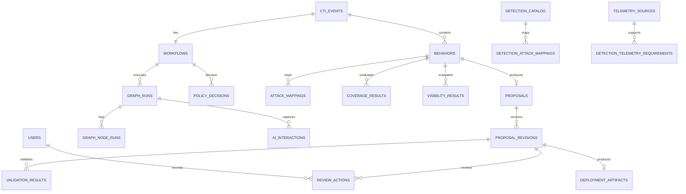

# Database documentation

This project uses PostgreSQL as the durable source of truth. Redis is not the primary state store; it is primarily used by Celery as the message broker and backend.

## 1. Database role in the platform

The database records:

- CTI events ingested from MISP
- workflow execution state and graph runs
- extracted behaviors and ATT&CK mappings
- telemetry sources and visibility results
- detection coverage decisions and policy outcomes
- proposal revisions and analyst review actions
- approved detection catalog records and deployment artifacts
- AI reasoning session data and watcher/audit output

## 2. Major tables

### Core CTI and workflow tables

#### users
- Stores platform user identities
- Important fields: `id`, `email`, `password_hash`, `display_name`, `role`, `active`
- Used by: JWT auth and RBAC enforcement

#### cti_events
- One row per event ingested from MISP
- Important fields: `misp_event_id`, `source`, `title`, `raw_event`, `normalized_event`, `status`, `received_at`
- Relationships: one-to-one with `workflows`, one-to-many with `behaviors`

#### workflows
- One row per CTI event lifecycle
- Important fields: `cti_event_id`, `status`, `terminal_reason`, `completed_at`
- Relationships: one-to-many with `graph_runs`

#### graph_runs
- One row per LangGraph execution attempt/resume
- Important fields: `workflow_id`, `resume_from_node`, `status`, `current_node`, `previous_node`, `started_at`, `finished_at`, `duration_ms`, `failure_reason`
- Relationships: one-to-many with `graph_node_runs`, `ai_interactions`, `proposal_revisions`

#### graph_node_runs
- Runtime node-level execution audit
- Important fields: `graph_run_id`, `node_name`, `status`, `input_snapshot`, `output_snapshot`, `started_at`, `finished_at`, `duration_ms`, `failure_reason`

### AI reasoning tables

#### ai_interactions
- Stores provider-level AI request/response data
- Important fields: `provider`, `model`, `prompt_version`, `schema_name`, `request_json`, `response_json`, `structured_justification`, `confidence`, `token_usage`, `estimated_cost`

#### ai_reasoning_sessions
- Captures an AI reasoning session tied to workflow and graph run
- Important fields: `workflow_id`, `graph_run_id`, `status`, `current_node`, `confidence_score`, `trust_score`, `approval_recommendation`, `termination_reason`, `session_summary`

#### ai_reasoning_revisions
- Tracks iterative reasoning changes and repair history
- Important fields: `session_id`, `behavior_id`, `proposal_id`, `revision_number`, `stage`, `reason`, `confidence_before`, `confidence_after`, `candidate_before`, `candidate_after`, `route_selected`

#### ai_watcher_results
- Stores watcher pass/fail/warning results from the reasoning engine

#### ai_confidence_events
- Stores per-node confidence events over time

### Behavior, ATT&CK, and coverage tables

#### behaviors
- One independently detectable behavior extracted from a CTI event
- Important fields: `cti_event_id`, `workflow_id`, `source_graph_run_id`, `summary`, `behavior_type`, `evidence_refs`, `observables`, `fingerprint`, `confidence`

#### attack_techniques
- Reference dataset (seeded baseline) with ATT&CK technique metadata
- Important fields: `technique_id`, `name`, `description`, `revoked`, `deprecated`, `tactics`, `platforms`, `data_sources`, `version`

#### attack_mappings
- Candidate or verified mapping between a behavior and ATT&CK technique
- Important fields: `behavior_id`, `technique_id`, `technique_name`, `tactic_id`, `tactic_name`, `verified`, `verification_status`, `evidence_refs`, `confidence`

#### coverage_results
- Stores the deterministic coverage decision for a behavior
- Important fields: `workflow_id`, `graph_run_id`, `behavior_id`, `coverage_status`, `matching_detection_ids`, `similarity_score`, `deterministic_rationale`

#### visibility_results
- Stores telemetry visibility status for a behavior
- Important fields: `workflow_id`, `graph_run_id`, `behavior_id`, `visibility_status`, `required_sources`, `available_source_ids`, `missing_sources`

#### policy_decisions
- Stores the final policy decision: `already_covered`, `visibility_gap`, `insufficient_evidence`, or `generate_candidate`

### Proposal and review tables

#### proposals
- One reviewable proposal per behavior
- Important fields: `behavior_id`, `workflow_id`, `status`, `current_revision_number`, `confidence`, `quality_score`

#### proposal_revisions
- Immutable revision snapshots of a proposal candidate
- Important fields: `proposal_id`, `behavior_id`, `workflow_id`, `graph_run_id`, `revision_number`, `sigma_yaml`, `sigma_json`, `structured_justification`, `confidence`, `token_usage`, `estimated_cost`

#### validation_results
- Deterministic result of Sigma validation and compilation
- Important fields: `proposal_revision_id`, `schema_valid`, `sigma_valid`, `compilation_success`, `quality_score`, `duplicate_status`, `telemetry_verified`, `attack_verified`, `errors`, `warnings`, `compiled_outputs`

#### review_actions
- Analyst actions on proposals: approve, request_changes, reject
- Important fields: `proposal_id`, `proposal_revision_id`, `analyst_id`, `action`, `comment`

### Detection catalog and deployment tables

#### detection_catalog
- Approved or generated rule catalog
- Important fields: `name`, `detection_type`, `source`, `content`, `normalized_logic`, `behavior_fingerprint`, `status`

#### detection_attack_mappings
- Links a cataloged detection to ATT&CK techniques

#### telemetry_sources
- Inventory of available telemetry sources
- Important fields: `name`, `category`, `platform`, `enabled`, `retention_days`, `fields`, `owner`

#### detection_telemetry_requirements
- Requirement mapping for telemetry needed by a detection

#### deployment_artifacts
- Generated file artifacts for Sigma YAML packages
- Important fields: `proposal_id`, `proposal_revision_id`, `artifact_type`, `file_path`, `checksum`, `artifact_metadata`

#### settings
- Key-value configuration state, including MISP ingestion schedule

## 3. Relationships

## 4. Workflow state lifecycle

The workflow state is driven by enums in `app/models/enums.py`:

- `CtiEventStatus`: pending, running, waiting_repair, ready_review, approved, rejected, failed, covered, visibility_gap, insufficient_evidence
- `WorkflowStatus`: pending, running, waiting_review, approved, deployed, rejected, failed, completed
- `GraphRunStatus`: pending, running, succeeded, failed, cancelled
- `ProposalStatus`: ready_review, approved, changes_requested, rejected, superseded, deployed
- `ReviewActionType`: approve, request_changes, reject

The application uses these statuses to coordinate graph execution, proposal review, and final detection publication.

## 5. Detection/proposal lifecycle

1. A MISP event is ingested as a `cti_event`.
2. A `workflow` is created for the event.
3. The graph extracts one or more `behaviors`.
4. The behavior is evaluated for ATT&CK verification, coverage, telemetry visibility, and policy gating.
5. A `proposal` is created once a candidate is ready for review.
6. Each proposal gets immutable `proposal_revisions`.
7. Validation results are stored in `validation_results`.
8. The analyst chooses `approve`, `request_changes`, or `reject`.
9. Approval leads to deployment artifact generation and a `detection_catalog` entry.

## 6. Migrations and model generation

The current initial migration uses Alembic to create the full schema via `Base.metadata.create_all(bind=bind)`.

Later migrations add:

- AI reasoning audit tables
- policy metadata and compliance fields
- additional database idempotency and state support

## 7. Practical observations

- The database is not just a cache; it is the authoritative operational state for detection engineering.
- AI outputs are stored as JSONB for traceability and auditability.
- The platform intentionally records decision history: graph runs, node runs, AI interactions, watchers, revisions, and review actions.
- The detection catalog is publication state, not merely a temporary candidate store.

## 8. Notable risk and limitation

This is a project database designed for local demonstration and controlled review. It records structured AI artifacts and review history, but it is still a local implementation with no advanced production-grade partitioning, retention policy, or full enterprise RBAC model beyond the implemented app roles.
