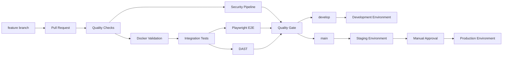
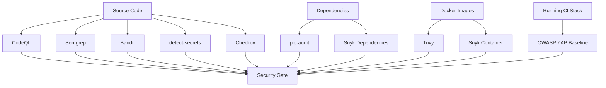
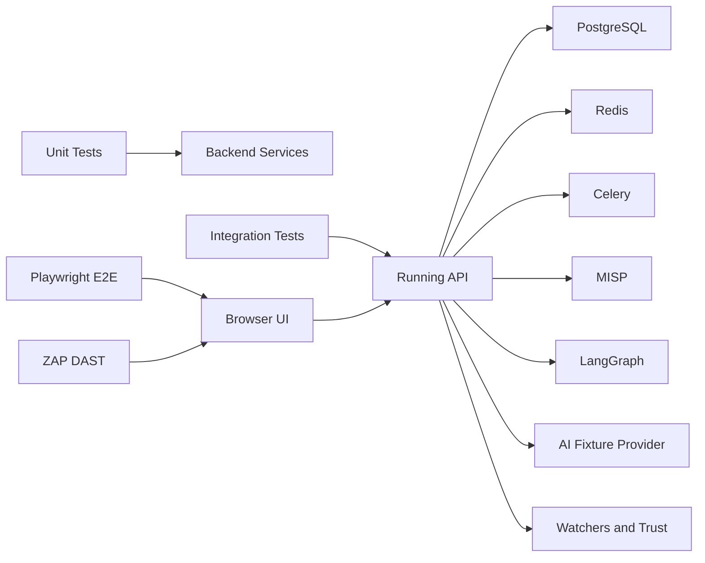
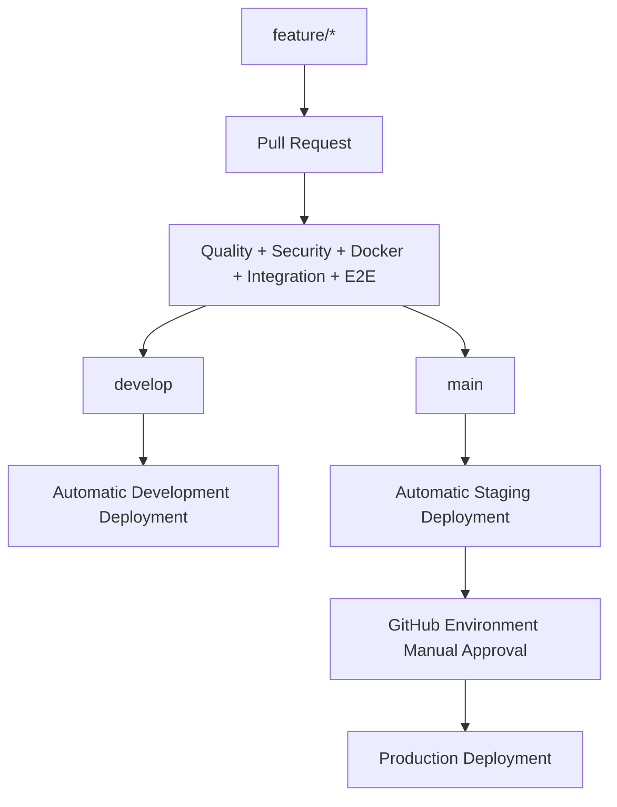

# DevSecOps Pipeline

This document describes the Dev -> CI -> QA -> Security -> Integration -> E2E -> Production pipeline wrapped around the CTI Detection Engineering Platform.

The pipeline does not redesign the application. It preserves the existing FastAPI backend, Next.js frontend, PostgreSQL database, Redis/Celery workers, MISP integration, LangGraph workflow, AI reasoning sessions, watchers, trust engine, review workflow, deployment artifacts, and detection catalog.

## Pipeline Architecture

## GitHub Actions Workflows

| Workflow | File | Purpose |
|---|---|---|
| Pull Request Quality Checks | `.github/workflows/pr-quality.yml` | Backend syntax, Ruff lint, Ruff format check, mypy, unit tests, frontend lint, TypeScript check, production build. |
| Security Pipeline | `.github/workflows/security.yml` | Snyk, CodeQL, SonarQube, Bandit, pip-audit, detect-secrets, Semgrep, Checkov, Trivy and container scans. |
| Docker Validation | `.github/workflows/docker-validation.yml` | Compose config, build, boot, container health, backend and frontend smoke checks, logs on failure, teardown. |
| Integration and E2E Tests | `.github/workflows/integration-e2e.yml` | Full stack with MISP, migrations, demo seed, MISP scenario, integration tests, ZAP DAST, Playwright E2E, reports. |
| Dev Staging Production Deployment | `.github/workflows/deploy.yml` | Build images, push to GHCR, deploy to GitHub Environments with manual production approval. |

## Quality Gates

No deployment should be approved unless these gates pass:

- Python syntax validation.
- Ruff lint.
- Ruff format check.
- mypy.
- backend unit tests.
- npm lint.
- TypeScript type checking.
- frontend production build.
- Docker Compose build.
- Docker health checks for backend, frontend, postgres, redis, nginx, worker, scheduler.
- integration tests.
- Playwright E2E tests.
- DAST baseline.
- static security scans.
- container scans.
- SonarQube quality gate when configured.

## Security Architecture

The security pipeline produces machine-readable reports under `artifacts/security`.

## Test Architecture

The integration workflow starts the full Compose stack with the MISP profile, applies migrations, seeds demo data, creates a fresh MISP scenario through the MISP API, and then validates the application through HTTP APIs.

The Playwright workflow validates browser-visible user paths:

- login;
- dashboard;
- threat queue;
- AI dashboard;
- AI workflow;
- review queue;
- detection catalog;
- ATT&CK coverage;
- system health;
- unauthorized redirect.

## SonarQube

`sonar-project.properties` configures:

- backend sources;
- frontend sources;
- Docker and GitHub workflow files;
- unit/integration/E2E tests;
- coverage report paths;
- duplications exclusions for Alembic migrations;
- quality gate waiting.

Required GitHub secrets:

- `SONAR_TOKEN`
- `SONAR_HOST_URL`

When these secrets are present, the security workflow runs SonarQube analysis and fails if the quality gate fails.

## Required GitHub Secrets

| Secret | Required For | Notes |
|---|---|---|
| `SNYK_TOKEN` | Snyk dependency, code and container scanning | Optional locally, required to enforce Snyk gates. |
| `SONAR_TOKEN` | SonarQube analysis and quality gate | Required when SonarQube gate is enabled. |
| `SONAR_HOST_URL` | SonarQube analysis | Example: `https://sonarcloud.io` or private SonarQube URL. |
| `DEVELOPMENT_DEPLOY_WEBHOOK` | Development deployment | Environment secret. |
| `STAGING_DEPLOY_WEBHOOK` | Staging deployment | Environment secret. |
| `PRODUCTION_DEPLOY_WEBHOOK` | Production deployment | Environment secret, protected by manual approval. |

Do not commit Snyk, SonarQube, MISP, DeepSeek, JWT or deployment tokens.

## Branch and Deployment Strategy

GitHub Environments should be configured as:

- `development`: automatic from `develop`;
- `staging`: automatic from `main`;
- `production`: manual approval required.

## Docker Validation

The Docker validation workflow performs:

1. `docker compose config`
2. `docker compose build`
3. `docker compose up -d`
4. health wait for backend, frontend, nginx, postgres, redis, worker and scheduler
5. backend health endpoint check
6. frontend smoke check through Nginx
7. log capture on failure
8. `docker compose down -v --remove-orphans`

The integration workflow repeats this with the `misp` profile and validates MISP-backed ingestion.

## DAST

Dynamic security testing runs only against the CI runtime stack, never production. OWASP ZAP baseline targets `http://127.0.0.1:8080` and writes JSON, HTML and Markdown reports to `artifacts/security`.

## Runtime Verification Notes

The repository now contains the pipeline, scripts and tests needed to execute the full DevSecOps flow in GitHub Actions. Local Docker runtime verification from this session was blocked because Docker Desktop was not reachable through the `dockerDesktopLinuxEngine` pipe.

Once pushed to GitHub, runtime evidence should be collected from workflow artifacts:

- backend unit JUnit report;
- integration JUnit report;
- Playwright HTML report, screenshots and videos;
- ZAP baseline report;
- Bandit, pip-audit, Semgrep, Checkov and detect-secrets JSON reports;
- Trivy SARIF reports;
- Snyk JSON reports when `SNYK_TOKEN` is configured;
- SonarQube quality gate result when SonarQube secrets are configured;
- Docker failure logs if any health check fails.

## Remaining Production Limitations

The pipeline improves engineering maturity, but these production limitations remain:

- deployment webhooks are integration points and must be connected to real infrastructure;
- Snyk and SonarQube require organization secrets;
- production secrets must be managed through GitHub Environments or an external secret manager;
- E2E coverage is a smoke suite and should be expanded as UI workflows stabilize;
- DAST is baseline scanning, not a full penetration test;
- Docker Compose deployment is suitable for CI and demo environments, not final enterprise orchestration.

## Acceptance Checklist

| Capability | Implementation | Status |
|---|---|---|
| GitHub Actions | Five workflows under `.github/workflows/`. | Implemented |
| Linting | Ruff, Ruff format check, mypy, npm lint and TypeScript checks. | Implemented |
| Static Security | Bandit, pip-audit, detect-secrets, Semgrep, Checkov, CodeQL, Snyk when configured. | Implemented |
| Dynamic Security | OWASP ZAP baseline against the CI runtime stack. | Implemented |
| Docker Validation | Compose config/build/up, health wait, endpoint checks, logs and teardown. | Implemented |
| Integration Tests | Runtime API tests covering platform health, MISP ingestion, LangGraph, AI sessions, watchers, proposals, review and catalog paths. | Implemented |
| End-to-End Tests | Playwright login, navigation, threat queue controls and unauthorized redirect tests with screenshots/videos on failure. | Implemented |
| Dev -> Staging -> Production Pipeline | GHCR image publication plus GitHub Environments and webhook deployment hooks. | Implemented |
| Documentation | This DevSecOps document and README link. | Implemented |
| Runtime Verification | Requires Docker Desktop/GitHub Actions runner. Local runtime execution was blocked in this session. | Blocked locally |
